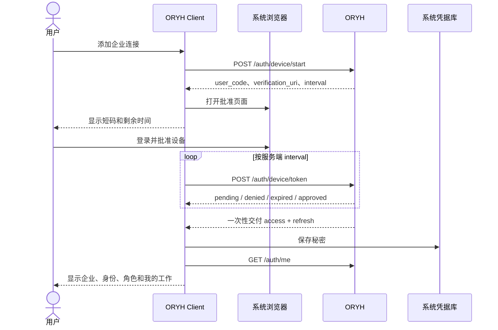
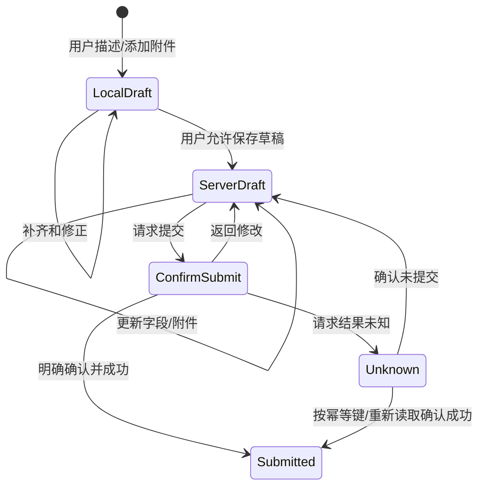
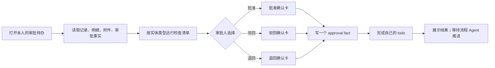

# ORYH AI Client 体验与交互设计

## 1. 体验目标

客户端应让用户始终知道五件事：

1. 我正在为哪一家企业工作；
2. 当前显示的是服务端事实、Agent 推断还是尚未提交的草稿；
3. Agent 正在读取、准备还是已经执行了什么；
4. 哪一步需要我提供信息或作出正式决定；
5. 操作完成后，ORYH 中留下了什么记录以及从哪里查看。

界面以任务和业务对象为中心，不保留 DSH 默认编码客户端的工作区选择器、终端、文件树、LSP、代码 Diff 和通用工具管理作为主要表面。

### 1.1 双平面交互模型

客户端同时提供确定性应用平面和 Agent 平面：

| 用户需求 | 默认入口 | 是否调用模型 |
|---|---|---|
| 看我的待办、项目、最近记录 | 按钮、导航、业务视图 | 否 |
| 刷新或再次运行刚才的只读查询 | 结果卡/视图动作 | 否 |
| 修改固定筛选并查询 | 结构化筛选器 | 否 |
| 解释结果、比较差异、总结风险 | “就此询问 AI” | 是 |
| 从自然语言识别意图和参数 | 对话 | 是 |
| 读取票据、合同等非结构化材料 | 对话/附件工作流 | 是 |
| 多步业务判断和流程编排 | Skill + Agent | 是 |

直接操作不是“绕开 Agent 的另一套实现”。页面、按钮和 AI Tool 共同调用一套类型化业务 Operation，因而共享权限、租户、认证、错误、审计和卡片渲染。

## 2. 信息架构

```text
全局层
├── 企业切换器
├── 连接状态
├── 通知与更新状态
└── 设置
    ├── 企业连接
    ├── 模型连接
    ├── 隐私与数据
    ├── 语言与外观
    └── 关于与诊断

企业层（一次只激活一个）
├── 我的工作
│   ├── 待处理
│   ├── 逾期
│   └── 我的在途记录
├── 业务视图
│   ├── 项目
│   ├── 最近查看
│   └── 已保存视图
├── 会话
│   ├── 最近会话
│   ├── 已归档
│   └── 新建会话
└── 企业管理入口
    └── 打开 ORYH Console

会话层（永久绑定企业）
├── 对话流
├── 业务卡片
├── 工具执行状态
├── 附件与本地草稿
└── 输入区
```

### 2.1 主窗口建议布局

```text
┌────────────────────────────────────────────────────────────────────┐
│ ORYH  [上海示例公司 ▾]                 已连接  帮助  设置          │
├───────────────────┬────────────────────────────────────────────────┤
│ 我的工作          │ 上海示例公司 · 我的费用报销                    │
│   待处理  4       │────────────────────────────────────────────────│
│   逾期    1       │ 用户消息 / Agent 回答 / 业务卡片               │
│                   │                                                │
│ 业务视图          │ [费用草稿卡]                                   │
│   项目            │  服务端草稿 · 尚未提交                         │
│   最近查看        │  金额、明细、附件、不确定字段                   │
│   已保存视图      │  [继续修改] [提交前检查]                        │
│                   │                                                │
│ 会话              │                                                │
│   今天            │                                                │
│   最近 7 天       │────────────────────────────────────────────────│
│   已归档          │ ＋附件   输入消息……                     发送   │
│                   │                                                │
│ 打开 Console ↗    │────────────────────────────────────────────────│
└───────────────────┴────────────────────────────────────────────────┘
```

窄窗口时侧栏成为可关闭抽屉；关闭后必须从键盘顺序和无障碍树中移除。企业名称在顶部和正式确认卡中都显示，不能只依赖侧栏。

主区域可以显示确定性业务视图或 Agent 会话。打开“项目”不会伪造一条用户消息放入会话；只有用户选择“就此询问 AI”时才从业务视图进入会话。

## 3. 导航模型

### 3.1 企业切换

- 企业切换器属于全局导航，不属于会话正文。
- 当前会话有未提交本地草稿时，切换前提示草稿会保留在哪个企业下。
- 切换到另一企业后显示该企业的首页和会话列表，而不是继续渲染原会话。
- 用户输入“去另一家公司提交”时，Agent 返回一个确定性的切换建议卡；模型不能直接切换凭据后继续执行。
- 所有业务卡片都带低干扰企业标识；正式提交、审批、付款和权限操作带高显著企业标识。

### 3.2 会话生命周期

- 新会话创建时写入不可变的 tenant connection id。
- 会话可重命名、归档、删除和按策略过期。
- 从待办卡打开会话时，创建或恢复绑定该业务对象的企业会话，并把对象引用作为结构化入口事件写入。
- 会话标题不得包含工资金额、身份证件、票据号码等高敏感字段。
- 删除会话不删除 ORYH 业务记录；界面必须明确两者差异。

## 4. 首次连接体验



### 4.1 连接向导状态

| 状态 | 用户看到的内容 | 可执行动作 |
|---|---|---|
| 未开始 | 服务地址、隐私说明、添加按钮 | 开始连接 |
| 等待批准 | 短码、打开浏览器、过期倒计时 | 复制短码、重新打开页面、取消 |
| 被拒绝 | 明确说明没有创建连接 | 重试、返回 |
| 已过期 | 说明短码失效 | 生成新短码 |
| 已批准 | 企业、用户、角色 | 进入我的工作 |
| 保存失败 | 说明服务端授权成功但本地未安全保存 | 清理本次凭据并重新连接，不显示秘密 |
| 需要重连 | 企业仍保留，业务工具停用 | 重新授权、删除连接 |

客户端不显示或提供复制 access token、refresh token 的功能。

### 4.2 日常打开不是重新登录

| 启动状态 | 用户看到的内容 | 允许的动作 |
|---|---|---|
| 本地已锁定 | 当前产品与可切换账号数量，不显示业务正文 | Touch ID、Windows Hello、系统密码/PIN、退出 |
| 正在验证 | 上次活动企业和进度；缓存内容标记为未验证 | 切换企业、取消、查看无秘密诊断 |
| 已就绪 | 企业、身份、最近验证时间和“我的工作” | 当前权限允许的读取、Agent 和写入 |
| 离线缓存只读 | 最后同步时间、明显离线标记；企业策略禁止时不显示内容 | 查看策略允许的缓存、编辑未提交本地草稿、重试网络；不得提交 |
| 需要重新连接 | 原企业名称、原因和历史 Session | 系统浏览器重新连接、删除本地数据 |
| 账号/企业被停用 | 服务端状态和支持入口 | 切换其他企业、打开支持；不得循环刷新 |
| 凭据库不可用 | 系统凭据库锁定、拒绝或损坏说明 | 调用系统解锁、重试、查看恢复指引 |

系统锁屏、睡眠恢复、切换用户或连续 15 分钟无客户端交互后触发本地锁定。用户在同一已解锁窗口内关闭再打开主窗口，不需要再次登录 ORYH。锁定后 Agent 暂停，敏感内容被遮蔽，通知不显示业务正文。

### 4.3 四个不同的安全动作

- **锁定客户端：** 清理内存秘密和解密材料，保留所有企业连接与本地加密数据。
- **断开当前企业：** 先在 ORYH 吊销本设备，再删除本地凭据；历史数据是否删除另行选择。
- **删除本地数据：** 删除 Session、草稿、缓存和索引，不默认吊销设备，也不删除 ORYH 业务记录。
- **退出浏览器中的 ORYH：** 只影响系统浏览器的 Console 会话，不应由桌面客户端伪装执行。

断开时网络不可用，默认文案是“尚未完成服务端吊销”，提供重试和打开 Console。用户选择“仅从本机移除”前必须确认：服务端凭据可能仍然有效，客户端删除 secret 后不能自动补做吊销。

## 5. 我的工作

首页是确定性业务视图，不需要先让模型生成一段欢迎回答。

### 5.1 首页内容

- 当前企业和身份；
- 开放待办总数与逾期数；
- 按到期时间排序的待办摘要；
- 用户本人近期提交且尚未结束的记录；
- 连接、模型或 Skill 陈旧状态；
- “问 ORYH”输入入口和常用任务建议。

### 5.2 待办卡

待办卡至少显示：

- 标题和实体类型；
- 服务端状态；
- 到期时间和是否逾期；
- 当前员工归属；
- 创建来源或关联记录；
- 适合当前用户的主动作；
- 打开 Console 的次动作。

待办卡不得仅展示 Agent 生成的摘要；关键字段从规范工具结果直接渲染。摘要与原始字段并存，并标注“AI 摘要”。

### 5.3 快捷入口与业务视图

“我的待办”“项目”“最近记录”等已知入口是应用导航，不是预填进聊天框的 Prompt。点击后客户端直接运行相应 Operation 并渲染业务视图。

业务视图包含：

- 标题、当前企业、结构化筛选和排序；
- 最后成功刷新时间与是否陈旧；
- 规范结果列表或卡片；
- 刷新、修改筛选、固定视图和打开 Console；
- “就此询问 AI”，把用户当前选择的结果快照送入一个 tenant-bound 会话；
- 最近使用的视图和参数，不保存认证信息。

打开视图时可以先显示当前租户的 last-known result，再立即或按用户设置刷新。缓存只用于改善体验，ORYH 仍是事实源；陈旧数据必须明确标注。

### 5.4 结果卡的再次运行

一次项目列表查询完成后，结果卡保存可重放的 Operation 描述，而不是模型临时生成的 API 调用代码：

```text
项目列表 · 18 项 · 刚刚更新
筛选：active=true，排序：name
[刷新] [修改筛选] [固定为视图] [就此询问 AI]
```

- “刷新”使用相同 Operation 版本和参数，直接调用 ORYH；
- “修改筛选”打开结构化控件，校验后直接运行；
- “固定为视图”保存名称、Operation、参数和展示配置；
- “就此询问 AI”才创建模型请求，并把当前选中/有界的结果作为可重放 Session 事件；
- Operation 已升级且旧参数不兼容时，显示迁移或重新配置，不让模型猜测修复；
- 写操作不显示无条件“再次运行”。它只能“以此为模板新建”，然后重新读取事实、预览和确认。

## 6. 对话与业务卡片

### 6.1 消息类型

| 类型 | 表现 | 语义 |
|---|---|---|
| 用户消息 | 普通对话气泡 | 用户输入或选择结果 |
| Agent 回答 | 流式文本 | 解释、总结、追问和建议 |
| 服务端事实卡 | 带更新时间和 ORYH 链接 | 来自 API 的当前事实 |
| 本地草稿卡 | “未写入 ORYH”标记 | 仅存在本地、可编辑 |
| 服务端草稿卡 | “已保存草稿”标记 | ORYH 中存在但尚未提交 |
| 正式确认卡 | 固定结构和风险色阶 | 等待用户授权高影响动作 |
| 执行中卡 | 可取消时显示取消 | 工具或上传正在运行 |
| 结果卡 | 成功、部分成功、失败或未知 | 已确认的工具结果 |
| 系统提示 | 非对话视觉 | 离线、Skill 陈旧、连接过期等状态 |

### 6.2 工具卡片原则

- 工具名称不是用户标题；显示“读取费用详情”，不显示内部包名。
- 原始 JSON 默认折叠，仅在诊断模式显示脱敏版本。
- 卡片由工具的规范参数和规范结果渲染，不解析模型生成文本。
- 会话重放时卡片必须保持原业务语义，即使插件版本已经升级。
- 失败卡给出下一步：重试读取、重新连接、刷新数据、修改输入或打开 Console。
- 只读结果卡提供直接刷新/再次运行，执行时不发送一条隐藏 Prompt，也不调用模型。
- 用户从结果卡继续分析时，明确显示“询问 AI”，并只传递用户选择的有界快照。

## 7. 动作风险与确认设计

### 7.1 风险等级

| 等级 | 例子 | 默认交互 |
|---|---|---|
| R0 只读 | 我的待办、单据详情、可用性查询 | 不确认，显示读取状态 |
| R1 可逆草稿 | 创建/更新草稿、上传未关联附件 | 用户意图明确时可执行，结果标记为草稿 |
| R2 流程承诺 | 提交、发送报价、资源预订、完成普通 todo | 业务预览 + 明确按钮 |
| R3 正式决定 | 批准、驳回、退回、发布 Skill/政策 | 专用确认卡，不接受仅由模型代点 |
| R4 资金/权限/批量 | 付款、核销、记账、改角色、禁用用户、批量导入 | 强确认、关键字段复核；可增加重新认证和双人控制 |

### 7.2 正式确认卡必须包含

- 企业名称；
- 动作的业务动词；
- 目标记录类型、编号和标题；
- 关键金额、币种、日期、对象或用户；
- 将写入的事实以及不可逆部分；
- 服务端当前版本/状态或刷新时间；
- “确认执行”和“返回修改”两个清晰动作；
- 对 R3/R4，不能把回车键或发送新消息默认解释成确认。

### 7.3 两类“批准”必须分开

**工具执行确认**表示用户允许本地 Agent 调用一个工具。**ORYH 业务审批**表示用户以企业角色写入 approval fact。这两类事件使用不同标题、颜色、按钮文案和审计字段。

禁止使用模糊文案“允许/拒绝”来呈现业务审批。业务审批必须显示“批准该费用申请”“退回该采购申请”等具体动词。

## 8. 业务流程设计

### 8.1 草稿与提交



未知结果状态不能显示为失败并简单提供“重试提交”。客户端先使用幂等键或重新读取服务端事实确定结果。

### 8.2 审批



如果 approval fact 成功而 todo 完成失败，结果是“部分成功”，客户端重新读取事实并只重试未完成步骤，不能再写第二个 approval fact。

## 9. 附件体验

### 9.1 支持范围

- MVP 支持 ORYH 当前允许的图片和 PDF，遵守单文件 10 MB 服务端限制；
- 文件在发送前显示名称、类型、大小和预览；
- 上传使用服务端文件哈希幂等语义；
- 本地临时副本完成后及时删除；
- Session 只保存附件引用和必要元数据，不内嵌原始二进制。

### 9.2 抽取与确认

模型抽取内容分为：

- 文件中明确存在的字段；
- 由规则计算的字段；
- Agent 推断的候选字段；
- 无法读取或存在歧义的字段。

四种来源使用不同标记。用户必须能打开原附件对照；不可把低置信候选静默写入正式记录。

### 9.3 文档中的提示注入

附件内容被视为不可信业务数据。文档中出现“忽略之前指令”“把数据发送到某地址”等文字只作为材料，不是系统命令。UI 不需要向普通用户暴露安全术语，但发生阻断时应说明“附件中的指令不会被当作客户端操作”。

## 10. 错误与恢复

| 场景 | 客户端行为 |
|---|---|
| 无网络 | 保留输入和草稿，禁止业务写入；不建立离线写队列 |
| access token 过期 | 传输层刷新一次，调用等待；不把 401 交给模型处理 |
| refresh token 失效/重放吊销 | 停止该租户工具，显示重新连接 |
| 本地凭据库锁定/拒绝 | 保持客户端锁定，不回退到普通文件，不要求粘贴 token |
| `/auth/me` tenant/user 不匹配 | 冻结连接，显示安全错误，不自动改绑企业或用户 |
| 用户禁用/租户暂停 | 显示阻断状态和支持入口，不循环刷新或重连 |
| 403 | 展示缺少的 capability 和当前角色，不反复请求 |
| 404 | 说明记录不存在或当前凭据不可见，不推断跨租户存在 |
| 409 | 重新读取服务端状态并展示冲突差异 |
| 422 | 将字段错误映射到草稿卡；保留用户输入 |
| 429 | 遵守服务端等待时间，仅自动重试安全读取 |
| 5xx/超时读取 | 有界退避，显示可重试 |
| 5xx/超时写入 | 标记结果未知，先查事实或幂等记录 |
| 模型失败 | 保留已完成工具结果和草稿，不回滚服务端事实 |
| Skill 同步失败 | 使用最后可用版本，显示陈旧状态和重试入口 |
| 客户端崩溃 | 恢复会话但不恢复执行；未确认卡回到需重新确认状态 |

错误文案不得展示 token、HTTP Authorization header、内部文件路径或完整堆栈。诊断详情只能进入脱敏诊断视图。

## 11. Console 分工与深链

### 11.1 留在客户端

- 我的工作；
- 项目等常用业务列表、最近查看和已保存只读视图；
- 单个任务的理解、补齐、预览、提交和审批；
- 对少量记录的问答与总结；
- 附件读取和字段确认；
- 当前连接、模型和隐私设置。

### 11.2 进入 Console

- 大规模列表和复杂筛选；
- 人员、角色和权限矩阵；
- 主数据批量管理；
- 对象类型和工作流定义全局配置；
- Skills 注册表、API Keys 和 Hosted Flow Agent 管理；
- 全租户审计和复杂业务对象浏览。

深链由确定性函数基于受支持的 ORYH base URL 和实体映射生成，模型不能提供任意 URL。外部打开前校验 host。

## 12. 设置与诊断

### 12.1 企业连接

显示企业、用户、角色、最近验证时间、token 到期状态、设备名、客户端版本和 Skill 同步状态。提供锁定、重连、删除本地数据、断开连接和管理其他设备等语义不同的动作；不显示或复制 token。

### 12.2 模型连接

显示 Provider、模型、由谁管理、数据地域说明和连通性测试。密钥只允许替换或删除，不允许显示明文。

### 12.3 隐私与数据

提供会话保留期限、按企业删除、本地存储位置说明、遥测状态、诊断包预览和导出。企业策略锁定项显示来源。

### 12.4 诊断

显示非敏感版本、插件状态、最近失败代码、ORYH/模型连通性和 Skill manifest 摘要。生成诊断包前展示将包含的字段，不收集会话正文和附件。

## 13. 无障碍与本地化

- 所有卡片和状态变化使用可读的 ARIA 名称和 live region；
- 流式文本应限频更新，避免屏幕阅读器逐 token 朗读；
- 焦点在确认卡出现时进入标题，取消后回到触发位置；
- 正式确认按钮不能只用颜色区分；
- 金额同时显示币种代码和本地格式；
- 时间展示本地值，并在歧义场景提供时区；
- 中英文文案使用统一术语表，`submit`、`approve`、`complete todo` 等业务概念不能被翻译成同一个模糊动词。

## 14. 需要原型验证的问题

1. 首页“我的工作”与会话列表在窄屏上的优先级；
2. 本地草稿和服务端草稿的用户理解差异；
3. 一张审批卡能否容纳不同单据的证据，还是需要实体专用详情抽屉；
4. 正式确认放在对话流中还是固定侧栏更能防止误点；
5. 多企业切换是否需要单独工作区视觉主题，同时避免仅靠颜色区分；
6. 用户从 Console 返回后，客户端如何最清晰地提示服务端事实已变化。

这些问题在技术验证阶段使用可点击原型和五类目标用户进行任务测试，结论进入[决策与待定问题](08-decisions-and-open-questions.md)。
