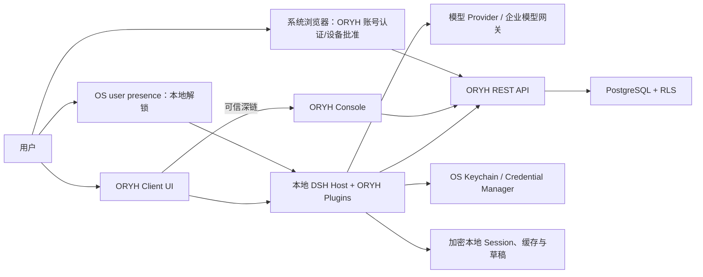
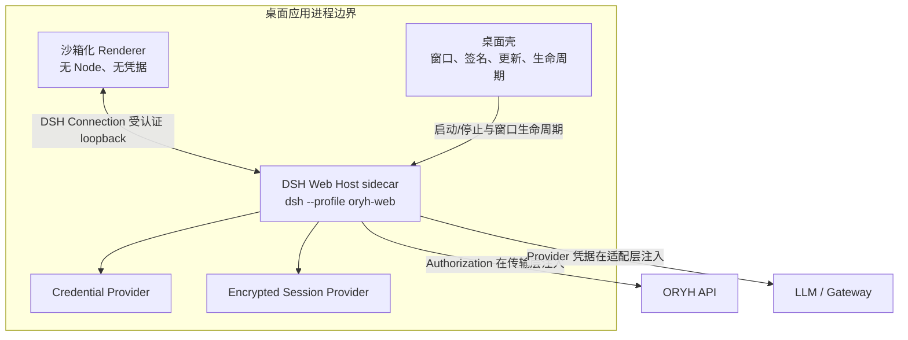
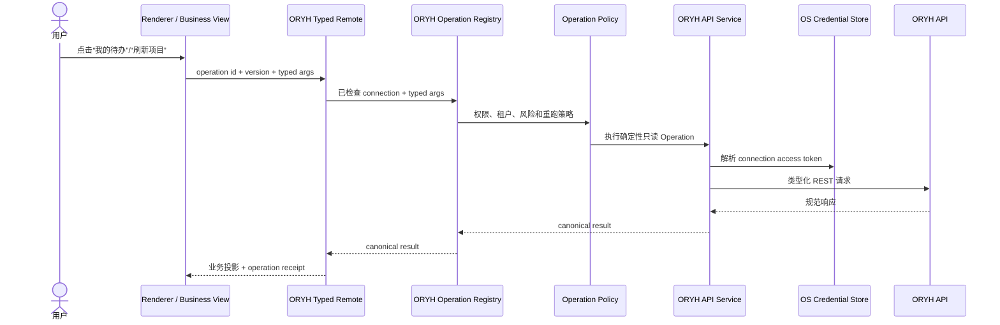
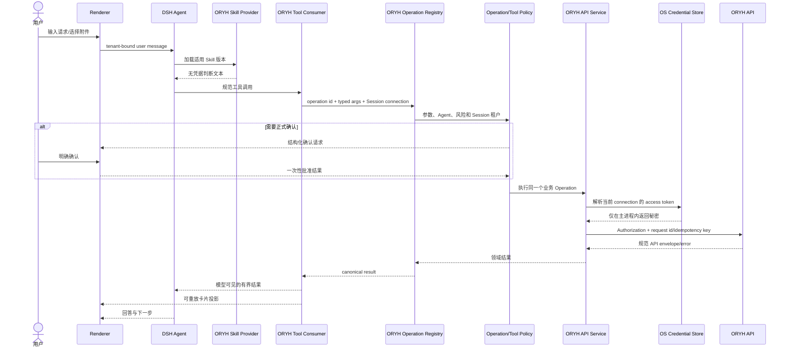

# ORYH AI Client 技术架构

当前实现以 [DSH 插件迁移](14-dsh-plugin-migration.md) 为准：已退役独立预览，通过 ORYH 根布局插件实现左菜单、中业务、右原生聊天；本页 AI 业务协作部分仍属于目标设计。


## 1. 架构目标

ORYH AI Client 使用 DSH 提供的 Agent loop、模型适配、Session 事件、工具/Skill 注册、Profile、Web App、浏览器 Connection、Typert Gateway/Remote 和 Client plugin 生命周期，但把 ORYH 产品能力保留为独立的外部插件与 Profile。

DSH Agent 是产品的一条执行路径，不是所有交互的必经层。已知业务入口直接调用共享 Operation；只有自然语言理解、非结构化材料、判断、解释和多步编排进入 Agent loop。

架构必须同时满足：

- ORYH 服务端继续是业务和权限的唯一事实源；
- 高频已知操作在模型不可用时仍能通过确定性业务视图执行；
- UI Action 与 AI Tool 共享同一个 Operation 实现；
- 浏览器/Renderer、模型和普通工具进程均拿不到真实业务凭据；
- 一个 Agent Session 只能调用一个租户的工具；
- Skill 判断文本与 API 机械调用分离；
- 工作空间由 capability、eligible Skill 与租户功能派生，不绑定固定角色名；
- 跨单据业务线程只从显式关系投影，可从 ORYH 完整重建；
- 存储事实、服务端派生值、Agent 结论和未执行 proposal 在数据与 UI 中保持可区分；
- 客户端可以升级 DSH 或在必要时替换其中的 Provider；
- 产品不依赖修改 DSH agent loop；
- 开发形态、桌面形态和企业托管模型形态共享同一业务插件层。

## 2. 系统上下文



### 2.1 责任边界

| 组件 | 拥有的责任 | 不拥有的责任 |
|---|---|---|
| ORYH Client UI | 快捷入口、业务视图、输入、预览、卡片、确认、导航、可访问性 | 令牌、RBAC 真相、独立 API 实现 |
| ORYH Plugins | 身份上下文、API 传输、工具、Skills、策略、投影 | 服务端业务状态真相 |
| DSH | Agent、Session、工具/Skill 注册、模型适配、UI 扩展 | ORYH 业务规则和租户凭据策略 |
| ORYH API | 租户隔离、权限、生命周期、幂等、记录、审计 | 对话状态、模型选择、本地 UI |
| ORYH Console | 全局浏览、配置和管理 | 自然语言任务执行和本地凭据 |
| 模型 Provider | 推理 | 权限决定、秘密保存、事实持久化 |

## 3. 运行时拓扑

### 3.1 开发与技术验证

本地验证通过 `dsh --profile oryh-web --no-open` 启动，不发布另一个 Node 应用入口。`oryh-web` 在 DSH Profile 中叠加官方 Web App 与 ORYH bundle，只绑定 loopback；DSH 启动 URL 的一次性 token 换取当前 authority 的 HttpOnly 签名 cookie，随后浏览器通过受 Host/Origin 检查保护的 `/api` 使用类型化 Remote。只允许测试租户和测试数据。该形态用于快速验证 Profile、Session、工具、Remote 和交互，不被定义为企业部署。

### 3.2 桌面生产形态



Renderer 只接收渲染所需的脱敏业务数据和 Session 事件。ORYH token、refresh token、模型密钥、Keychain 引用解析能力和任意本地文件能力都留在 Host。

DSH `0.1.2-alpha.1` 的 `client-connection` 已提供启动 token、签名 HttpOnly cookie、loopback Host/Origin 检查和 `/api` trust fence；ORYH 在此之上使用 Gateway 的严格 codec，而不把它称作“原始无认证 Webserver”。桌面 shell 仍必须限制导航、preload 和外链，并以严格 CSP 保护 Renderer。若将来改用 custom protocol 或 IPC，它只能承担窗口/生命周期桥接；业务调用仍复用命名的 Remote，不另建任意 Host RPC 面。

## 4. DSH 组装策略

### 4.1 依赖方式

- 本仓库精确锁定 DSH `dsh-v0.1.2-alpha.1`（`cd5ef81481`）及其 Cordis 依赖闭包；
- ORYH 插件作为 out-of-tree npm workspace packages 开发；
- 安装器创建 `oryh-web` Profile，依次叠加 `dsh-base`、`dsh-web-app` 与 `@oryh/dsh-bundle` 的 patch layer；每次升级先用 `dsh --profile oryh-web --dump-config` 审核最终树；
- 开发、测试、发布和桌面 sidecar 都通过 `dsh --profile oryh-web` 启动；ORYH 不新增 package bin、内联 Cordis tree 或绕过 DSH Loader 的 Node 应用；
- 发布时由 ORYH 安装器携带经过验证的 DSH runtime、Profile 和 ORYH client bundles；
- 只有插件机制无法表达的通用缺口才在 ORYH 的 DSH fork 中维护补丁，并优先提交上游。

详细决策见 [ADR-0001](adr/0001-dsh-integration-strategy.md) 与 [ADR-0007](adr/0007-dsh-web-profile-and-typed-remotes.md)。

### 4.2 Profile 基线

ORYH Profile 选择 DSH `web-app` 的浏览器内核，而不是继承默认 coding 产品。每个 ORYH Session 通过 `oryh-business` preset 得到业务 persona 和受限工具集合；Host 层只保留必须跨 Session 或由浏览器 Remote 使用的服务。

| DSH 默认能力 | ORYH 处理 |
|---|---|
| `standard` / `ptc` agent preset | 不采用；新建 `oryh-business` preset，并以 ORYH persona 覆盖 deployment persona |
| PTC tool presentation | 禁用；业务工具以窄类型原生 Tool 调用呈现，不让模型写 TypeScript 编排 API |
| DSH local Workspace Controller | 可保留作 Harness Session 组织，但不用于 ORYH capability 派生的业务工作空间或业务线程 |
| Bash / PowerShell | 生产 Profile 禁用 |
| 文件写入与编辑 | 生产 Profile 禁用；附件通过专用服务读取 |
| LSP / terminal / jobs | 生产 Profile 禁用 |
| 通用 Web 搜索 | 默认禁用；未来按企业策略单独启用 |
| Cordis self-modification | 禁用 |
| 通用 Skills filesystem roots | 不作为 ORYH Skill 来源；由 tenant-scoped Provider 取代 |
| DSH 本地 credential file | 只可保存 DSH 浏览器会话签名材料等非 ORYH 业务秘密；ORYH/model 生产秘密使用 OS provider |
| DSH JSONL Session persistence | 由 ORYH 加密 Provider 或明确的无持久模式替换 |
| `client-connection` + Gateway | 复用作为受认证的 loopback transport、严格 Remote codec、取消和重连基础；不把 ORYH REST 暴露到 Renderer |
| Client Modules、slots、renderer、locale | 复用公共 `dsh.client`/`./client` 插件机制；全部 ORYH 文案走 locale dictionary |
| Conversation/chat/primitives | 选择性复用对话壳、持久事件渲染和基础组件；增加 ORYH 业务卡与根布局 |
| `ui-approval` | 只承接 DSH 工具的一次性允许/拒绝；ORYH 审批、付款和正式 decision 使用独立业务卡与服务端事实 |

### 4.3 浏览器 Remote 与连接恢复

`@oryh/dsh-api-remotes` 由 Host/Client 两面组成：Host 将 ORYH controller 的 generated Remote descriptors 注册进 Typert Gateway，Client 通过 `ctx.remote` 挂载同一份 descriptor。业务 React 组件只消费类型化的 ORYH Remote、业务投影和 slot props；不能 `fetch` ORYH、构造 `/api` path 或保存 Authorization。

Remote API 分为三类：连接/认证状态、确定性 Operation/业务投影，以及 Session-scoped Agent 控制。前两类只接收受检查的 opaque connection 或 session reference，并在 Host 解析租户和 credential generation；第三类由 DSH Session Controller 定位 Agent。任何需要连续推送的 ORYH 投影都在 Remote stream opening frame 给出完整 baseline，或给出可验证 cursor；浏览器重连后以 replacement baseline 收敛。普通 forwarded events 只降低 UI 延迟，不能作为可恢复业务事实。

### 4.4 Session、模型与直接操作

DSH 的 Session log 是模型历史来源，因此所有抵达模型的 ORYH context、选中的结果快照、Tool call/result 与业务确认结果必须由扩展后的 Session event vocabulary 重放。直接 Operation 的 receipt、最近结果和业务投影默认不进入 Session；只有用户明确“就此询问 AI”时，Host 裁剪并记录一份 model-visible 事件。该隔离既保留无模型入口，也避免将全量业务缓存送入模型。

## 5. 规划的插件与模块

包名是设计名称，实施时可调整，但责任边界不得无说明地合并。

| 模块 | DSH 角色 | 责任 |
|---|---|---|
| `@oryh/dsh-bundle` | Bundle/Profile layer | 组装产品、禁用开发工具、挂载全部 ORYH 插件 |
| `@oryh/dsh-auth` | Service Provider | device flow、启动认证状态机、连接验证、刷新协调、吊销和重新连接 |
| `@oryh/dsh-credentials-os` | Credential Provider | macOS Keychain、Windows Credential Manager；只返回引用所需秘密 |
| `@oryh/desktop-presence` | Product shell service | Touch ID/Windows Hello/系统凭据、本地锁定、OS 锁屏/睡眠/用户切换事件 |
| `@oryh/dsh-tenants` | Service + Session context | 管理连接目录，创建 tenant-bound Agent scope |
| `@oryh/dsh-api` | Service Provider | ORYH HTTP、认证头、刷新、超时、重试、幂等、错误映射 |
| `@oryh/dsh-api-remotes` | Host/Client Remote assembly | 生成并挂载连接、Operation、投影与 ORYH 业务事件的 Typert Remote；只公开命名方法与 JSON codec |
| `@oryh/api-contract` | 生成契约 | 固定 OpenAPI 快照、类型和兼容性基线 |
| `@oryh/dsh-operations-*` | Operation Providers | 按业务域实现共享的类型化查询/命令、规范结果和风险元数据 |
| `@oryh/dsh-tools-*` | Tool Consumers | 把允许的 Operation 投影为模型工具，不重复 API 实现 |
| `@oryh/dsh-tool-policy` | Hook/Guard | 权限交集、风险分级、正式确认和网络目标限制 |
| `@oryh/dsh-skills` | Skill Provider | 按租户同步 manifest、版本和缓存；当前 bundle 仅经 Host 内存兼容适配后发布无秘密内容 |
| `@oryh/dsh-context` | Prompt/Context Provider | 注入当前企业、身份、角色、权限、时区和版本；不含秘密 |
| `@oryh/dsh-ui-shell` | Client UI plugin | 通过 `dsh.client`、slots 和 locale 提供首页、企业切换、导航、品牌和设置 |
| `@oryh/dsh-workspaces` | Projection/registry | 由 capability、eligible Skill 和租户功能生成“我的工作/提交/决策/领域”工作空间 |
| `@oryh/dsh-business-threads` | Read projection | 沿显式外键和 typed links 构建有界、可重建的跨单据线程 |
| `@oryh/dsh-evidence` | Evidence service | 生成 proposal 的事实引用、服务端派生值及 Policy/Workflow/对象定义/Skill 版本依据 |
| `@oryh/dsh-ui-views` | Operation Consumers | 快捷入口、业务列表、最近结果、已保存视图和无模型刷新 |
| `@oryh/dsh-ui-business` | Conversation/slot Consumers | 待办、单据、审批、附件、确认和结果卡；只从 Remote/session props 读取状态 |
| `@oryh/dsh-session-store` | Session persistence Provider | 租户分区、加密、保留、删除、搜索策略 |
| `@oryh/dsh-telemetry` | Telemetry Provider | 脱敏健康指标、显式策略和诊断导出 |
| `@oryh/dsh-console-links` | Pure service | 校验 base URL 并生成支持的 Console 深链 |
| `@oryh/desktop` | Product shell | 受控启动/停止 `dsh --profile oryh-web`、Renderer 沙箱、系统集成、签名更新 |

### 5.1 完整能力缝规则

跨包能力使用 DSH/Cordis 的 Service Definition、Service Provider 和 Consumer 三类角色表达。示例：

- `oryh-api` 定义请求与结果服务；OS credential provider 为它提供秘密解析；业务 Operation 是 Consumer；
- `oryh-operations` 提供规范业务执行；页面/按钮和 AI Tool 分别是 UI Consumer 与 Model Consumer；
- `oryh-skills` 提供 Skill source；DSH Skill registry 聚合；Skill loader 是 Consumer；
- `oryh-session-store` 提供持久化；Session lifecycle 是 Consumer；UI 只读取投影。

生命周期注册必须通过 effect/listener disposer 完成，热重载和关闭时释放网络、观察器和文件句柄。

## 6. 租户与 Session 模型

### 6.1 连接标识

本地 `ConnectionId` 是不透明标识，指向：

- ORYH base URL；
- tenant id、tenant slug 和显示名；
- user id、employee id、角色与权限快照；
- OS credential references；
- 服务端 credential/device id 与本地 credential generation；
- 最近验证与 Skill 同步状态。

tenant slug 只用于展示和命名，不是授权依据。每次连接验证以 `/auth/me` 返回的 tenant id 和权限为准。

一个连接对应一个 `(ORYH origin, tenant id, user id, installation id)` 授权。`installation_id` 是本安装随机生成的不可公开秘密之外标识，不使用 MAC 地址、磁盘序列号或其他硬件指纹。重新连接可以沿用本地 `ConnectionId`，但必须替换整个 credential bundle 并递增 generation。

### 6.2 Session 不变量

每个 Session 创建时写入并固定：

- `connectionId`；
- ORYH tenant id；
- ORYH API origin；
- 创建时的用户 id；
- 当前 Skill manifest digest；
- 客户端与插件版本。

模型可见的企业名称、身份和权限摘要必须通过 Session 事件可重放。凭据引用和真实值都不进入 Session 事件。详细决策见 [ADR-0003](adr/0003-tenant-bound-sessions.md)。

### 6.3 Scope

Agent scope 从 Session 的 connection id 构造。所有 ORYH services、Skills、Operations、tools、context 和 UI projections 都从该 scope 获取租户，不接受模型传入 tenant id 来切换租户。业务 Operation 参数可以包含服务端对象 id，但不能包含另一个 connection id 或凭据引用。

### 6.4 客户端认证状态

认证状态由 Host 拥有，Renderer 只收到可展示的投影：

```text
Booting
→ LocalLocked
→ LoadingConnection
→ Refreshing?
→ Verifying(/auth/me)
→ Ready | CachedReadOnly | ReconnectRequired | AccountBlocked
```

- `LocalLocked` 表示本机秘密和业务数据尚未释放，不代表 ORYH credential 失效；
- `CachedReadOnly` 只允许读取带时间标记的本地加密投影，不发布写 Operation 和 Agent 业务工具；
- `Ready` 只能由 `/auth/me` 与本地 origin/tenant/user 完全匹配产生；
- 多企业启动只验证上次活动 connection，其他连接在切换时惰性验证；
- 状态变化通过类型化事件发布，不把 access/refresh、Keychain handle 或浏览器 Cookie写入事件。

完整状态机见 [登录、认证与设备会话设计](09-authentication-and-login.md)。

## 7. 两种执行路径

### 7.1 确定性应用操作

“我的待办”、项目列表、业务视图刷新和只读结果重跑走确定性路径：



该路径不创建隐藏 Prompt、不运行 Agent loop、也不调用模型。模型没有配置或暂时不可用时，它仍然工作。`Typed Remote` 只接受登记的 operation id 与 schema 参数，并在 Host 绑定当前 connection；它不是 Renderer 可调用的通用 API proxy。

### 7.2 Agent 对话操作



两条路径共享 Operation、policy、API transport 和 card projection。差别只在 Consumer：UI 已经知道要做什么时直接调用；Agent 在理解和判断后通过 Tool 调用。

### 7.3 从结果转入 Agent

业务视图默认存在于应用投影，不进入 Session，也不消耗模型上下文。用户点击“就此询问 AI”时，Host 把用户选择的、有界的最新结果转换为 model-visible 且 logged 的 Session 事件，然后启动或继续 tenant-bound Agent。不能把整个缓存数据库或未选择的列表隐式塞入模型。

### 7.4 工作空间、业务线程与状态收敛

工作空间 registry 读取当前 `/auth/me` 权限、eligible Skill manifest/reach 与租户可用定义，生成稳定 workspace id 和可见 Operation 集合。它只生成导航投影，不授予 capability，也不接受角色名作为授权捷径。权限或 Skill audience 变化会处置旧 scope、使未执行 proposal 失效，并重新生成工作空间。

业务线程 projector 对每一种支持的业务弧声明允许的关系边：例如 quotation → sales order → sales invoice → payment/application，purchase request → purchase order → receiving/inventory → purchase invoice → payment/application。它只使用 API 返回的显式外键与 custom object typed links；不按标题、金额、日期或模型相似度建立关系。投影无独立写 API，可随时丢弃并从 ORYH 重建。

开放 todo、记录状态和服务端派生值通过状态式 reconciliation 收敛。启动、切换企业、恢复网络、完成 Operation 与收到推送信号后执行有界刷新；推送只降低延迟，不成为真相源。列表查询显式设置分页/上限，局部失败保留每个来源的独立陈旧标记，避免一次跨域 fan-out 失败让整条业务线程伪装为空。

## 8. ORYH API 层

### 8.1 契约来源

- 把经过审核的 ORYH `/openapi.json` 固定为本仓库版本化输入；
- 生成 TypeScript 请求/响应类型和 endpoint 元数据；
- 构建时检测 OpenAPI 快照漂移；
- 破坏性变化必须更新工具、卡片、契约测试和版本兼容表；
- 运行时只信任网络响应边界的解析结果，不能假设服务端永远与编译版本一致。

当前审计基线含 `app/api` 中 326 个员工/租户 API 路由声明和 60 个 SQLAlchemy 映射模型。OpenAPI 生成层可以覆盖全部已用响应类型，但 Operation registry 只发布产品明确采用的有界查询和业务动作；不能机械地把每个路由转换成一个模型工具。附件读取使用所属单据提供的 document-scoped 路由，普通客户端不申请租户级任意附件能力。

### 8.2 传输职责

`oryh-api` 统一处理：

- base URL 规范化和 allowlist；
- Authorization 注入；
- access token 到期与 refresh token 单次轮换；
- 同一连接的 refresh single-flight；
- access/refresh/到期时间/credential id/generation 的 credential bundle 原子替换；
- 超时、取消和响应大小上限；
- 读取的有界退避；
- mutation request id 与服务端支持的 Idempotency-Key；
- ORYH envelope 解包和错误分类；
- correlation id 记录；
- 日志字段脱敏。

业务工具不得自行读取 Keychain、拼接 Authorization header 或实现刷新。

刷新成功的完成点不是收到 HTTP 响应，而是新 credential bundle 已原子写入系统凭据库。刷新等待者只能在该完成点之后继续。服务端已旋转、客户端保存前崩溃且超过 retry grace 时进入 `reconnect-required`；客户端不保留旧 token 的第二份普通文件备份。

### 8.3 错误类型

传输层向工具提供稳定的领域错误：unauthenticated、reconnect-required、forbidden、not-found-or-invisible、conflict、validation、rate-limited、transient-read-failure、mutation-outcome-unknown。模型只看到解决任务所需的说明，不看到堆栈、请求头和秘密。

## 9. Operation 与工具架构

### 9.1 Operation 是执行来源

Operation 对应一个可审计业务动作或有界查询，例如“读取我的开放待办”“列出项目”“创建工时草稿”“提交费用申请”。它是页面、按钮、已保存视图和 AI Tool 共同使用的执行来源。禁止 UI 和 Tool 分别拼接相同 HTTP 调用，也禁止暴露通用 HTTP method/path/body Operation。

每个 Operation 定义：

- 稳定 id 和版本；
- 严格的参数 schema；
- 规范 JSON 输出；
- 应用视图与对话卡片使用的纯 presentation；
- 所需 ORYH capability；
- 风险等级；
- 执行类别：Query、Draft command、Lifecycle command、Human decision、Ledger post、Governance publish、Batch job 或 Automation control；
- 是否支持幂等、自动读取重试和取消；
- 是否允许无模型重跑、缓存或固定为视图；
- 结果未知时的恢复查询；
- 允许的 API origin 和 endpoint 模板；
- R2–R4 所需 evidence packet 字段与失效条件。

AI Tool 是 Operation 的适配器：它增加模型可见 description/schema、把 canonical result 裁剪成模型需要的内容，并通过 DSH Tool pipeline 记录调用。它不拥有另一份网络实现。

### 9.2 Operation receipt 与已保存视图

成功的直接操作生成不含凭据的 receipt：

- operation id/version；
- connection/tenant binding；
- canonical typed args 或其安全投影；
- 执行时间、服务端 `updated_at`（若提供）、读取时间和 correlation id；
- 用于 UI 重放的 presentation metadata；
- 风险等级和是否可直接 rerun。

只读 Operation 可以从 receipt 刷新或再次执行。已保存视图保存 operation id/version、用户命名、结构化参数和展示设置。Operation 版本升级时由代码迁移参数或要求用户重新配置，绝不保存和运行模型生成的 TypeScript、Shell 或 `curl`。

Mutation receipt 只表示历史结果。用户选择“以此为模板新建”时创建新的 proposal，重新读取关键服务端事实并按当前风险策略确认；旧 receipt 不是新的执行授权。

### 9.3 可见工具计算

模型可见工具集合是以下集合的交集：

```text
产品已安装工具
∩ 当前用户服务端权限允许的工具
∩ 当前 Agent Profile 允许的工具
∩ 当前 eligible Skill/任务需要的工具族
∩ 企业安全策略允许的工具
```

ORYH 服务端继续做最终授权。本地收窄的目标是减少误调用和 prompt injection 的可利用面，不代替服务端 RBAC。

Skill 是否 eligible 由 `capability AND (capability mode OR targeted audience)` 决定。Audience 只能缩小 Skill 指引投放，不能补足 capability；`/my/skills/reach` 的角色原因只用于解释，不进入任何自动授权或提权流程。

MVP 使用固定的小型工具目录。工具数量增长后，引入 DSH scoped restriction/渐进披露，让模型先选择 Skill/领域，再看到相关工具，避免把全部 ERP API schema 放入每次请求。

### 9.4 两步业务写入

对于需要正式确认的动作，模型或表单首先产生规范化 action proposal。UI 从 proposal 渲染确认卡。用户确认后，策略层签发只对该 operation id/version、参数摘要、connection/Session 和短时间窗口有效的一次性 approval；任何参数变化都使确认失效。

不要让模型在用户确认后重新生成一份可能不同的参数。

R2–R4 proposal 同时绑定 evidence digest。Evidence packet 包含当前详情/明细、附件引用、主数据、服务端派生指标、approval facts、开放 todos，以及适用 Policy、Workflow、对象定义和 Skill 的 id/version/hash。任何关键事实或依据变化都会使 confirmation token 失效。ORYH 当前没有通用 ETag/version，因此第一版以服务端可得 `updated_at`、状态与执行前重新读取降低竞争窗口；不能把这描述成完整的乐观并发保证。

## 10. Skill 架构

### 10.1 远程 Provider

ORYH Skill Provider 按 Session tenant scope 工作。当前服务端的 `/my/skill-bundle` 会把短期 access key 渲染进 Skill 文本，因此 Provider 分成两条明确路径：

1. 使用当前 user credential 获取 eligible manifest；
2. 获取 reach 解释并保留 capability 与 audience 两类原因；
3. 比较 name、version 和 content hash；
4. **当前兼容路径：** Host 从 `/my/skill-bundle` 读取原始 ZIP 到内存，按已知 ORYH bundle 结构解析并移除被渲染的 `ORYH_API_KEY` 认证字段；原始 ZIP/Markdown 立即丢弃，不写缓存；
5. **目标路径：** 使用 ORYH 未来提供的按用户权限返回的 canonical 无凭据 Markdown/references endpoint；
6. 对即将发布的结果验证大小、名称、hash、文件类型和零秘密断言；不符合预期时拒绝本次更新，不把“尽力清洗”后的内容交给模型；
7. 原子发布仅含无秘密内容的新目录，失败时保留 last-known-good；
8. 将版本、hash 和 eligibility 摘要记录到 Skill 加载事件。

该 Provider 不依赖 DSH filesystem provider 的单层目录扫描，也不把 ORYH personal ZIP 解压到共享 `~/.agents/skills` 或任何持久目录。多企业 Skills 按 connection id 分区，由 Session scope 选择。兼容路径允许当前客户端开始开发，却不是长期 content contract：ORYH 无凭据 endpoint 完成后应删除该适配器。

### 10.2 模型上下文

Skill 正文进入模型可见历史，因此必须满足 DSH 的“model-visible 等于 logged”原则。正文中允许：

- 业务判断和检查顺序；
- 当前租户定义的流程说明；
- 工具名称和非秘密业务字段；
- Console 的受控业务路径说明。

正文中禁止：

- access/refresh token；
- Authorization header；
- 模型 Provider key；
- 本地 Keychain 路径或 secret reference；
- 要求使用 Bash/curl 绕过工具的指令；
- 任意外部上传目标。

### 10.3 REST 与未来 MCP

首版使用 ORYH REST API，因为现有 Console、flow runner 和 Skills 都以 REST 为契约。`oryh-api` 的 Consumer 不依赖具体 transport 细节；当 ORYH MCP 达到产品条件时，可以增加 MCP Provider 承担部分机械调用，但 Skill 判断层和 Session/租户不变量保持不变。

## 11. ORYH 服务端依赖与差距

### 11.1 MVP 阻断项

1. **生产写入幂等语义。** 对客户端会自动恢复的 mutation，服务端需要 Idempotency-Key + canonical request hash；同 key 不同 body 返回 409。未覆盖的 endpoint，客户端不得自动重试。
2. **稳定的关联标识。** 响应返回 request/correlation id，使客户端结果可以与 audit log 对齐。
3. **安全的设备凭据交付。** approved device secret 必须具有强制短 TTL 和后台清理；并发 poll 通过行锁或原子状态转换保证只有一个请求拿到凭据；device/token/refresh 响应设置 `Cache-Control: no-store`。
4. **当前设备自助吊销。** 普通用户可以使用当前 user-bound device credential 幂等吊销自己这一台设备。断开失败时客户端不能伪装成已完成。
5. **设备批准保护。** approve/deny 统一执行同源和 CSRF 校验；旧浏览器会话批准新设备前要求 recent authentication；start、短码和 poll 有独立限流与稳定机器错误码。

### 11.2 P1 依赖

1. **无凭据 canonical Skill content。** 按当前用户权限返回 content/references，不渲染 access token，提供按名称读取、hash/ETag 与 include 语义；完成后移除临时 bundle adapter；
2. 用户自助查看、重命名和吊销自己的其他设备，而不是只有 `keys.manage` 管理员处理 API Keys；
3. 对并发编辑提供版本字段或 ETag/If-Match；
4. 为客户端深链提供稳定的实体到 Console URL 约定；
5. 提供稳定、机器可读的错误 code，避免依赖英文 `detail`；
6. 明确附件内容读取的缓存和授权头策略；
7. 保持当前结算路径 PostgreSQL 行锁和真实并发测试为发布门禁，并为新增财务端点逐项补充 request-body 幂等摘要、Decimal API 语义和并发/未知结果测试；
8. refresh grant 的绝对/不活跃期限，以及密码重置、账号禁用和风险事件的级联失效；
9. R4 操作的服务端 step-up challenge、短期 assurance 和最终写入验证；
10. 浏览器侧企业 SSO 与 MFA/Passkey；客户端继续只使用系统浏览器。

### 11.3 非阻断项

ORYH MCP 不阻断客户端首版。Hosted Flow Runner 的 DSH adapter 也不属于客户端 MVP。

## 12. 本地数据与存储

| 数据 | 存储 | 规则 |
|---|---|---|
| refresh/access credential bundle | OS Keychain/Credential Manager | 整体原子替换，不进入普通文件和 Session |
| 模型 key | OS Keychain 或企业网关 | Renderer 与模型不可读取原值 |
| 本地数据加密 key | OS Keychain | 每安装或每用户生成，可轮换 |
| Connection 非秘密元数据 | 加密或 owner-only 设置库 | tenant/user id 可视为敏感元数据 |
| Session 事件 | 加密 Session Provider | 按租户分区、可保留/删除 |
| UI 投影与搜索索引 | 加密派生存储 | 可从 Session 重建，删除同步 |
| 工作空间与业务线程投影 | 加密派生存储或内存 | tenant-bound、有刷新时间；只沿显式关系，可从 ORYH 重建 |
| Operation receipts、最近操作和已保存视图 | 加密派生存储 | tenant-bound、无凭据、版本化；只读可重跑 |
| Skill 缓存 | 租户分区缓存 | 仅保存经严格适配/endpoint 得到的无凭据内容、hash 验证、last-known-good；绝不保存原始 personal ZIP |
| 附件临时文件 | 临时加密/受限目录 | 使用后删除，不进入通用工作区 |
| 诊断日志 | 结构化脱敏日志 | 有界保留，不含正文和秘密 |

DSH 当前本地 YAML credential provider 的 `0600` 只能隔离其他 OS 用户，不能隔离同 UID 的模型工具进程，因此不满足生产秘密存储要求。由于 ORYH Profile 禁用通用文件工具，风险进一步降低，但 OS Keychain 仍是必须条件。

## 13. UI 与 Host 通信

### 13.1 原则

- Renderer 不直接调用 ORYH；
- 所有 UI Remote endpoint 由 DSH Connection + Typert Gateway 承载，以当前 Session/connection 上下文解析租户；
- Renderer 不能提交任意 URL、method 或 Authorization；
- Gateway 的 unary/stream descriptor 在 Host 和 Client 两面验证 schema、取消和返回值；ORYH Client plugin 不自建业务 HTTP/WebSocket 协议；
- Connection generation 就绪后才读取 ORYH 初始投影；断线后以 Remote 的 replacement baseline/cursor 收敛，不假定转发事件可以补齐；
- Host 对调用来源、schema、大小、频率和生命周期做验证；
- UI 展示卡使用持久化的 presentation metadata 重放，不依赖重新调用 ORYH；
- 当前事实需要显式刷新并显示刷新时间。
- UI 只能用注册的 operation id 和 schema 参数调用 Host，不能提交任意 API path。

### 13.2 首页与无模型操作

设备连接、企业切换、首页刷新、我的待办、项目等业务视图、只读结果重跑、设置、删除缓存和打开 Console 不需要模型参与。它们通过注册的确定性 Operation 或 Host API 执行。这样即使模型未配置或不可用，用户仍能完成已知操作。

设备连接、本地解锁、刷新、`/auth/me` 验证、锁定和断开也不进入 Agent loop。Renderer 只能触发命名的 auth intent 并订阅脱敏状态；Host 决定是否调用系统浏览器、OS user-presence、Keychain 和 ORYH auth endpoint。系统浏览器与 Renderer 使用不同 Cookie/storage partition，客户端不提供嵌入 WebView 登录。

## 14. 桌面封装与发布

### 14.1 推荐路径

第一阶段用 `oryh-web` DSH Web Profile 完成纵向切片。桌面封装默认优先验证 Electron：其职责是沙箱窗口、Keychain/系统集成和受控 sidecar 生命周期，并启动同一 `dsh --profile oryh-web`，而不是把 ORYH Plugin 另做成 Node 应用。是否最终采用 Electron 仍需完成安全、启动、包体、更新和崩溃恢复 spike；Tauri 只有在 Node sidecar 生命周期、loopback trust 与签名更新同样可靠时才成为候选。

### 14.2 桌面要求

- Renderer sandbox、context isolation、禁用任意导航和新窗口；
- 只允许受控 ORYH/帮助深链进入系统浏览器；
- Host 随桌面生命周期关闭并等待 Session 持久化；
- 单实例与协议唤起不允许注入任意命令或 URL；
- 安装包、更新 manifest 和二进制签名验证；
- 支持企业禁用自动更新并指定内部更新源；
- 崩溃报告默认不包含 Session 内容和内存 dump。

## 15. 版本与上游策略

### 15.1 DSH

- package.json 和 lockfile 固定 `0.1.2-alpha.1`；记录 tag `dsh-v0.1.2-alpha.1`、commit `cd5ef81481`、Cordis 版本和启用 Profile/Client plugin roster；
- 升级先在独立分支执行 `dsh --profile oryh-web --dump-config` 差异审查、Profile Loader smoke、Session replay、`test:snapshot`/`test:web` 等价测试、安全和端到端测试；
- 禁止 ORYH 包导入未公开的 DSH `src` 路径；
- 需要核心修改时记录 fork patch、上游 issue/PR 和移除条件。

### 15.2 ORYH API

- 固定 OpenAPI snapshot 与支持的最小/最大服务端版本；
- 客户端启动时读取服务能力或版本信息；
- 服务端缺少客户端所需 capability 时降级或拒绝相关功能，不猜测；
- Skill manifest 和 API 契约分别版本化。

### 15.3 本地格式

Session、connection 和缓存格式各自有 schema version。预发布阶段可以不兼容旧格式，但迁移或明确清理必须可观察，不能静默丢失用户草稿。

## 16. 可观测性

### 16.1 本地结构化事件

允许记录：时间、版本、连接的不可逆匿名 id、Session 匿名 id、工具名、风险级别、耗时、结果类别、HTTP status、错误 code、重试/刷新次数、Skill hash 和 correlation id。

默认禁止记录：消息正文、Skill 正文、工具完整参数/结果、附件内容、业务标题、人员姓名、邮箱、记录自然语言、token 和请求头。

### 16.2 运维指标

- 启动和崩溃；
- 模型可用性和请求时延；
- ORYH API 读取/写入成功率；
- 401 刷新与重连率；
- 409/422 业务冲突率；
- Skill 同步成功率和陈旧持续时间；
- 正式确认展示、取消和执行结果；
- 未知 mutation outcome 数量。

遥测是否上传由用户选择和企业策略共同决定，策略只能进一步收紧，不能绕过默认脱敏。

## 17. 实施期间必须保持的架构检查

每个新功能评审都回答：

1. 意图和参数是否已经明确，能否先做成无模型 Operation/业务视图？
2. 这项状态的唯一事实源在哪里？
3. UI 与 AI Tool 是否共享同一个 Operation？
4. 是否让模型、Renderer、Session 或日志看见了秘密？
5. 是否可能跨 tenant-bound scope 调用？
6. 为什么需要新 Operation，而不是组合已有窄 Operation？
7. 风险等级和确认卡是什么？
8. 请求结果未知时如何恢复？
9. UI 卡片如何从规范数据重放？
10. 是否能通过外部 DSH 插件完成？
11. ORYH Console 是否更适合承载该交互？
12. 需要哪些 OpenAPI、Skill、Session 和安全测试？
