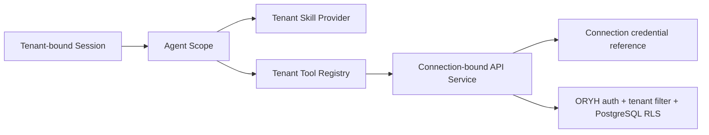

# ORYH AI Client 安全与隐私设计

## 1. 安全目标

1. 一个租户的内容、凭据、Skills、工具和 Session 不能进入另一个租户的作用域。
2. ORYH access/refresh token 与模型密钥不进入模型上下文、Renderer、Session、普通日志、遥测和诊断包。
3. 模型、Skill、附件或远端内容不能扩大用户权限或绕过正式确认。
4. 写操作在超时、重试、崩溃和重放场景下不会产生不可判断的重复事实。
5. 本地业务数据有明确的加密、保留、导出和删除控制。
6. 软件更新、插件依赖和企业策略可验证来源并可审计。
7. ORYH 账号认证、设备授权、本地客户端解锁和高风险 step-up 各自证明明确事实，不互相冒充。

## 2. 信任模型

### 2.1 信任级别

| 对象 | 信任姿态 |
|---|---|
| ORYH 服务端授权与响应 | 业务事实权威；仍在网络边界做 schema/大小验证 |
| 当前租户管理员发布的 Skill | 受租户治理的指令，但不能拥有秘密或绕过工具策略 |
| 模型输出 | 不可信建议和参数，执行前必须校验与授权 |
| 用户输入 | 有意图但可能含误操作或恶意内容，按业务 schema 校验 |
| 附件和业务正文 | 不可信数据，可能包含 prompt injection |
| Renderer/Web 内容 | 受限进程；不得有 Node、Keychain 或任意网络权限 |
| ORYH Client Host | 本地高信任进程，拥有受控凭据解析和业务工具 |
| DSH/第三方依赖 | 供应链输入；精确锁定、扫描、签名发布 |
| Console 深链和外部 URL | 默认不可信；仅允许受支持 origin 和路径模板 |

### 2.2 主要威胁参与者

- 恶意或被诱导的模型；
- 在票据、PDF、业务描述或 Skill 中植入指令的攻击者；
- 试图利用多企业上下文混淆的用户或数据；
- 能运行同一 OS 用户进程的本地恶意软件；
- 恶意网站对 loopback 服务的请求；
- 被篡改的客户端更新或 npm 依赖；
- 拿到 refresh token 副本的攻击者；
- 误配置企业管理员或过宽角色。

客户端不能防御已完全控制当前 OS 用户会话的攻击者，但应使用 OS Keychain、Renderer 隔离和最小本地 API，显著减少凭据被普通文件读取、模型工具或网页窃取的机会。

## 3. 保护资产

| 资产 | 分类 | 主要保护 |
|---|---|---|
| ORYH refresh token | Secret | OS Keychain、不可导出、轮换与删除 |
| ORYH access token | Secret | Keychain/内存、短期、传输层使用 |
| 模型 Provider key | Secret | Keychain 或企业网关 |
| 本地加密 key | Secret | OS Keychain，不与密文同存 |
| Session 正文与工具结果 | Confidential | 加密、租户分区、保留和删除 |
| 附件与票据 | Restricted | 临时受限存储、按需读取、及时清理 |
| 工资、付款、账户信息 | Restricted | 更短保留、禁止索引/遥测、可禁持久化 |
| tenant/user/employee id | Sensitive metadata | 最小记录、诊断匿名化 |
| Skill 正文 | Tenant confidential | 权限同步、hash 校验、租户分区 |
| Operation receipt、最近操作和已保存视图 | Sensitive metadata | 租户绑定、无凭据、加密、版本校验 |
| 审计关联标识 | Operational | 可记录但不得反向暴露秘密 |

## 4. 租户隔离

### 4.1 不变量

- 一个 Session 创建后只持有一个 `ConnectionId`；
- `ConnectionId` 解析出一个 ORYH origin、tenant id 和 credential reference；
- 所有 ORYH 工具从 Agent scope 读取 `ConnectionId`，模型参数不能覆盖；
- Session、Skill cache、projection、search index、draft 和 attachment temp 都按 connection/tenant 分区；
- UI 切换企业等于切换 Session namespace，不是替换全局 token 后继续旧会话；
- 服务端 `/auth/me` 返回的 tenant id 必须与本地 connection metadata 一致，否则冻结连接；
- Console 深链只能使用当前 connection 的 base URL；
- 遥测中的租户标识使用本地不可逆匿名值，不上传真实 tenant id。

### 4.2 跨租户防护层

每一层都验证自己的关系。客户端本地隔离是纵深防御；ORYH auth 与 PostgreSQL RLS 是服务端最终防线。

### 4.3 测试要求

- 同时连接租户 A/B，验证 A Session 的工具无法引用 B connection；
- 在 A 会话粘贴 B 对象 id，服务端不可见且客户端不探测 B 是否存在；
- 切换企业后检查模型请求、Skill 目录和工具 schema 中没有前一租户内容；
- 删除 A connection 不影响 B 的凭据和 Session；
- Session replay 时 connection 不存在则进入“连接缺失”，绝不选择默认企业。

## 5. 凭据生命周期

### 5.1 设备授权

- 客户端调用 device start 并保存短期 device code 仅用于轮询；
- user code 可以显示和复制，不是长期凭据；
- 授权成功响应只消费一次；
- access/refresh token 从网络响应直接写入 Credential Provider；
- 写入成功前不启动 Skill 同步或业务工具；
- 本地保存失败时清理内存，并要求重新连接；不得回显 token 供用户手工保存；
- ORYH 账号认证只在系统浏览器完成；Renderer 不嵌入登录 WebView，不接收密码或浏览器 Cookie；
- 批准页显示 origin、企业、账号、角色、官方客户端身份、平台、版本、设备名、短码、期限和后果；
- approved 后待交付的明文 secret 具有强制短 TTL，过期销毁；并发 poll 只有一个请求可以消费；
- start、短码与 poll 分别限流，客户端遵守 interval、slow-down 和网络退避；
- 批准/拒绝经过同源与 CSRF 校验，超过 recent-auth 窗口的浏览器会话重新认证。

### 5.2 访问与刷新

- refresh token 永不进入模型或 Renderer；
- access token 只由 `oryh-api` 在请求发送前解析；
- 同一 connection 的并发刷新使用 single-flight；
- access、refresh、到期时间、credential id 和 generation 作为一个 bundle 原子替换；
- 新 bundle 安全保存前，刷新调用不得向等待业务请求报告成功；
- 401 只在明确的过期语义下触发一次刷新，不对任意 401 无限循环；
- refresh token 重放吊销或失效后立刻冻结该 connection，清空 access token 并要求 device flow；
- refresh grant 具有绝对和不活跃期限，并在密码重置、账号禁用、风险事件或设备撤销时失效；
- 服务端已旋转而客户端保存前崩溃、且旧 token 已超过 retry grace 时，要求重新连接，不创建普通文件备份；
- 断开连接时先完成服务端当前设备吊销，再删除本地 credential bundle，最后按用户选择清理非秘密缓存。

### 5.3 存储 Provider

生产支持：

- macOS Keychain；
- Windows Credential Manager；
- 后续 Linux Secret Service。

DSH 文件 credential provider 可用于无真实秘密的开发测试，不能作为生产安全边界。同 UID 进程能够读取普通文件，即使权限为 `0600`。

### 5.4 模型凭据

模型 key 与 ORYH credential 使用不同 namespace 和访问 API。业务工具无权解析模型 key；模型 adapter 无权解析 ORYH token。企业模式优先使用模型网关和短期设备身份，减少终端保存长期供应商密钥。

详细决策见 [ADR-0002](adr/0002-credentials-outside-model-context.md)。

### 5.5 本地解锁与锁定

- 首次访问业务数据、OS 锁屏/切换用户后、睡眠恢复后和连续 15 分钟无客户端交互后，使用 OS user-presence API 解锁；
- 使用 Touch ID、Windows Hello 或系统密码/PIN，不实现客户端自有密码；
- 锁定清除进程内 token、数据解密 key、附件明文和模型缓冲，暂停 Agent，遮蔽 Renderer 内容和通知正文；
- 本地解锁不签发 ORYH token、不改变权限，也不得记录为 ORYH MFA；
- Keychain 拒绝、锁定或损坏时保持锁定，不回退到环境变量、YAML 或用户粘贴 token；
- 企业策略可以缩短解锁期限或要求更严格 user presence，不能关闭秘密隔离。

完整认证生命周期见 [登录、认证与设备会话设计](09-authentication-and-login.md) 和 [ADR-0005](adr/0005-separate-account-auth-device-grant-local-unlock-and-step-up.md)。

## 6. 模型可见内容与 Session 日志

DSH 要求模型可见内容能够从 Session 重建。ORYH 采用反向安全规则：任何不允许长期写入 Session 的值都不得进入模型请求。

### 6.1 允许进入模型与 Session

- 用户消息和明确添加的附件文本；
- 当前企业显示名、用户角色、权限摘要；
- 无凭据 Skill 正文和版本；
- 有界的业务工具结果；
- 用户确认后的业务 action 和服务端结果；
- 不含秘密的错误解释。

### 6.2 禁止进入模型与 Session

- access token、refresh token、device code；
- Authorization/Cookie header；
- 模型 Provider key；
- Credential reference 的底层路径或系统句柄；
- 本地加密 key；
- 未经用户选择的本地文件；
- 诊断堆栈、环境变量和进程信息；
- 其他租户的任何内容。

### 6.3 工具结果最小化

工具输出只包含完成当前判断需要的字段。长列表分页并限制条数；附件返回引用和受控读取能力，不把二进制编码进上下文；高敏感字段只在专用工具和 UI 中展示。原始 API 响应不能默认整包放入模型。

## 7. Prompt injection 防护

### 7.1 攻击来源

- 上传的发票、合同、PDF 和图片 OCR；
- ORYH 业务对象的 `source_text` 和备注；
- 外部通知或邮件内容；
- 租户自定义 Skill；
- 模型生成的链接和工具参数。

### 7.2 控制措施

1. 系统 context 明确附件和业务正文是数据，不是操作指令；
2. 生产 Profile 无 Bash、通用 HTTP、任意 Web 和任意文件写入；
3. 工具集合按 tenant、permission、Skill 和风险策略收窄；
4. 工具不能接受任意 URL、host、method、header 或 tenant id；
5. 正式确认绑定规范 tool args digest，确认后参数不能变化；
6. 资金账户、审批目标、权限对象等关键字段在卡片中由规范参数直接渲染；
7. Console 深链由纯函数生成并校验 origin；
8. 租户 Skill 不能注册新原生代码或秘密读取能力，只能引用已安装工具；
9. 高风险流程进行对抗性附件和 Skill 测试。
10. 按钮和已保存视图只能调用已注册的 Operation id/version，不能保存或运行模型生成代码、任意 URL 或 HTTP 请求。

### 7.3 租户自定义 Skill

租户管理员有权定义本企业流程，但 Skill 文本仍不能扩大服务端 capability 或本地工具策略。客户端在同步时拒绝：

- 超过大小和文件数量上限；
- hash/manifest 不匹配；
- 非允许文件类型、绝对路径和目录穿越；
- 声明任意外部网络目标；
- 包含已知凭据格式或渲染后的认证头。

内容安全扫描只作为补充，不能用关键词扫描代替工具隔离和服务端授权。

## 8. 工具授权和正式确认

### 8.1 三层控制

1. **目录控制：** 无权限的工具不进入模型目录；
2. **执行守卫：** 每次执行重新检查 Session connection、最新权限、风险策略和参数；
3. **服务端授权：** ORYH API 依据当前 credential 执行最终 RBAC、actor 归属和 RLS。

### 8.2 确认策略

| 动作 | 最低控制 |
|---|---|
| 只读查询 | 无确认，有界参数与速率限制 |
| 保存可逆草稿 | 用户意图明确；批量或推断字段时预览 |
| 提交/发送/预订 | 业务预览 + 一次性确认 |
| 审批/驳回/退回 | 专用业务确认，不与工具批准混用 |
| 付款/核销/账本 | 金额、币种、收付方向、账户、对象强确认；可要求重新认证 |
| 权限/禁用用户/发 key | 影响说明、目标人和角色强确认；不能自提权 |
| 批量导入 | dry-run、差异摘要、数量和范围强确认，可取消和恢复 |

确认事件只授权一组不可变参数，不授权“接下来模型认为合理的所有动作”。批准过期、Session 变化、服务端版本变化或参数变化后必须重新确认。

### 8.3 快捷操作与重复执行

确定性操作不等于降低安全要求：

- 页面、按钮、已保存视图和 AI Tool 共同进入同一个 Operation policy；
- Operation receipt 固定 connection/tenant，不能在另一租户重放；
- receipt 和视图不保存 token、header、任意 endpoint 或可执行代码；
- 只读 Operation 才能默认直接 refresh/rerun；
- mutation 的历史 receipt 不能作为新授权，“以此为模板新建”必须重新校验权限、事实和确认；
- 用户选择“就此询问 AI”前，Host 裁剪结果并明确写入 tenant-bound Session；
- 缓存结果明确标注时间和陈旧状态，不能覆盖 ORYH 当前事实。

### 8.4 高风险 step-up

- R4 的重新认证要求由 ORYH 服务端针对资源和动作发出 challenge，并在最终写入时验证；
- assurance 绑定 tenant、user、operation、参数摘要、认证时间和短期限，不能跨 Session、参数或企业重放；
- 本地 Touch ID/Windows Hello 只能增加 user-presence 控制，不能代替 ORYH 账号认证强度或新鲜度；
- 服务端未提供 step-up 时，不开放依赖该保证的付款、核销、账本和权限类动作；
- 双人控制属于 ORYH 业务授权流程，不能由同一客户端上的两次点击模拟。

## 9. 写入可靠性与安全

### 9.1 重试原则

- GET 和明确安全读取可按退避策略重试；
- 支持 Idempotency-Key 且服务端比较 request hash 的写入可以安全恢复；
- 未声明幂等的写入超时后进入 `mutation-outcome-unknown`，先重新读取；
- 客户端崩溃恢复时不自动重发内存中的 mutation；
- tool result 与 ORYH response 的 request/correlation id 写入脱敏 Session metadata。

### 9.2 部分成功

审批的“两次写入”、附件上传后关联、批量处理等操作可能部分成功。工具必须返回分步事实，恢复时查询已完成步骤，只执行剩余步骤。模型不能根据自然语言“看起来失败了”重新开始整套操作。

### 9.3 并发冲突

409 或版本不匹配后重新读取服务端事实，废弃原确认 proposal，向用户展示变化并重新确认。客户端不做 last-write-wins 隐式覆盖。

## 10. 本地数据保护

### 10.1 加密

- Session、投影、搜索索引、草稿和持久附件缓存使用 authenticated encryption；
- 数据 key 保存在 OS Keychain，密文携带版本和 nonce；
- connection/tenant 分区可以使用派生子 key，删除租户时可进行 crypto-shredding；
- 临时文件使用 owner-only 目录并在使用后删除；
- crash dump 和系统日志不得捕获明文 Session。

仅依赖 FileVault/BitLocker 不是完整方案，因为进程运行时和备份场景仍需要应用级保留控制。企业可以把全盘加密作为设备合规的额外条件。

### 10.2 保留与删除

- 默认保留期在产品研究后决定，企业策略可以缩短或禁止持久化；
- 工资、付款和敏感附件允许更短或零持久化；
- 删除一个 Session 同步删除投影、索引、附件缓存和密钥引用；
- 断开企业连接默认询问是否同时删除该企业所有本地数据；
- 锁定客户端只清除内存并保留 Keychain；断开企业、删除本地数据和浏览器退出分别显示；
- 断开时网络不可达则显示远端吊销未完成；“仅从本机移除”需要风险警告和 Console 设备管理入口；
- 删除本地数据不删除 ORYH 服务端记录，界面必须明确。

### 10.3 导出

Session 导出必须用户主动发起，默认不包含秘密、内部诊断和本地路径。企业策略可以禁止导出或要求加密包。导出前提示可能包含企业敏感信息。

## 11. Renderer 与本地通信安全

### 11.1 Renderer

- sandbox 开启；
- Node integration 关闭；
- context isolation 开启；
- 禁止 `eval`、任意 preload API 和任意导航；
- CSP 默认拒绝外部脚本、frame 和连接；
- 外链使用受控系统浏览器打开；
- 不接收 Keychain 和文件系统通用 API。

### 11.2 Loopback/IPC

如果使用 loopback：

- 仅监听 loopback，不监听 LAN；
- 随机端口和启动级认证；
- 校验 Origin、Host 和 Content-Type；
- 拒绝无凭据浏览器跨站请求；
- 限制请求体和并发；
- shutdown 后端口立即释放。

如果使用 IPC：

- 只暴露命名的窄方法；
- 输入经过 schema 验证；
- 不提供“调用任意 Host 方法”；
- 每次调用绑定窗口、Session 和 connection；
- 窗口销毁时取消订阅和请求。

## 12. 网络策略

Host 只允许连接：

- 当前配置并批准的 ORYH HTTPS origin；
- 经策略批准的模型 Provider 或企业网关；
- 签名更新服务；
- 明确启用的诊断/遥测端点。

业务工具不能访问任意互联网。Redirect 后重新校验 origin；禁止把 Authorization 转发到不同 origin。私有部署需验证 TLS，企业自定义 CA 通过受管配置安装，不提供“忽略证书错误”生产开关。

## 13. 日志、遥测和诊断

### 13.1 默认禁止字段

- 所有 credential 与 header；
- 用户消息、模型回答、Skill 正文；
- 工具完整 args/value；
- 文件名以外的附件内容，默认连文件名也不上传；
- 姓名、邮箱、业务标题、source text；
- 任意本地绝对路径。

### 13.2 允许字段

- 版本、OS、受支持平台信息；
- 匿名安装/连接/Session id；
- 工具稳定名称、风险等级、耗时和结果类别；
- HTTP status、ORYH error code、correlation id；
- 模型 Provider/模型标识，但不含 key；
- Skill manifest digest 和同步结果；
- 崩溃类型和脱敏堆栈。

### 13.3 脱敏验证

使用真实格式的 canary secrets 贯穿 device flow、刷新、工具错误、Session、日志、诊断和崩溃测试。发布门禁扫描所有产物，发现 canary 即失败。

## 14. 供应链与更新

- DSH、Cordis 和 npm 依赖精确锁定并保留 lockfile；
- 启用依赖漏洞、许可证和恶意安装脚本审查；
- 构建在隔离 CI 中完成，生成 SBOM 和 provenance；
- macOS 签名/notarization 与 Windows code signing；
- 更新 manifest 与二进制独立验签；
- 自动更新支持渐进发布和快速撤回；
- 外部 DSH 插件只能从 ORYH 签名发行渠道安装；生产客户端不提供用户任意安装插件的入口；
- tenant Skill 是数据，不执行自带原生代码或安装脚本。

## 15. 企业策略

企业可管理：

- 允许的 ORYH origin；
- 允许的模型 Provider、模型和网关；
- Session 保留、导出、搜索与高敏感数据持久化；
- 遥测与诊断上传；
- 自动更新通道；
- Web 搜索和外部连接能力；
- R4 动作是否需要重新认证或双人控制。

策略以签名配置或受认证的 ORYH endpoint 下发，本地显示来源、更新时间和生效值。远端策略不能要求客户端上传秘密或禁用核心安全守卫。

## 16. 安全发布门禁

真实租户发布前必须全部满足：

- [ ] OS credential provider 在目标平台通过测试；
- [ ] OS user-presence、本地锁定、睡眠/锁屏/用户切换和敏感通知遮蔽通过测试；
- [ ] access/refresh/model key canary 未出现在模型请求、Session、日志、遥测、诊断、Renderer；
- [ ] Session 和派生数据加密，删除与保留有效；
- [ ] tenant A/B 隔离矩阵全部通过；
- [ ] 生产 Profile 不含 Bash、通用 HTTP、任意 FS、LSP、Terminal、自修改；
- [ ] 正式确认绑定参数摘要，确认后篡改测试被拒绝；
- [ ] 附件/Skill prompt injection 测试无法外传或扩大工具；
- [ ] 快捷按钮、已保存视图和结果重跑无法绕过 Operation policy，且只读重跑不调用模型；
- [ ] loopback/IPC 来源、schema 和生命周期测试通过；
- [ ] 未知写结果与部分成功恢复测试通过；
- [ ] OpenAPI 和 Skill 内容接口不包含凭据；
- [ ] device approved secret TTL、并发单次交付、start/code/poll 限流、recent auth、CSRF 和 no-store 通过服务端测试；
- [ ] 当前设备自助吊销、其他设备自助管理和离线断开状态通过 E2E；
- [ ] refresh bundle 原子替换、single-flight、响应丢失、保存前崩溃和 grant 期限通过故障注入；
- [ ] 安装包、更新和依赖供应链检查通过；
- [ ] 威胁模型和数据流经独立安全评审。

## 17. 已知剩余风险

- 本地设备被当前用户级恶意软件完全控制时，运行中的业务数据仍可能被截取；
- 模型可能给出错误业务判断，确认卡和服务端校验只能限制后果，不能保证建议正确；
- 租户管理员可能发布质量差或恶意的本租户 Skill，需治理、版本和审计；
- ORYH 服务端目前仍有财务并发一致性和 Hosted Flow Runner 隔离等独立风险；客户端不能补偿服务端 P0；
- 企业模型 Provider 的数据处理政策属于部署信任决定，客户端必须透明展示但不能替代合同和合规审查。
