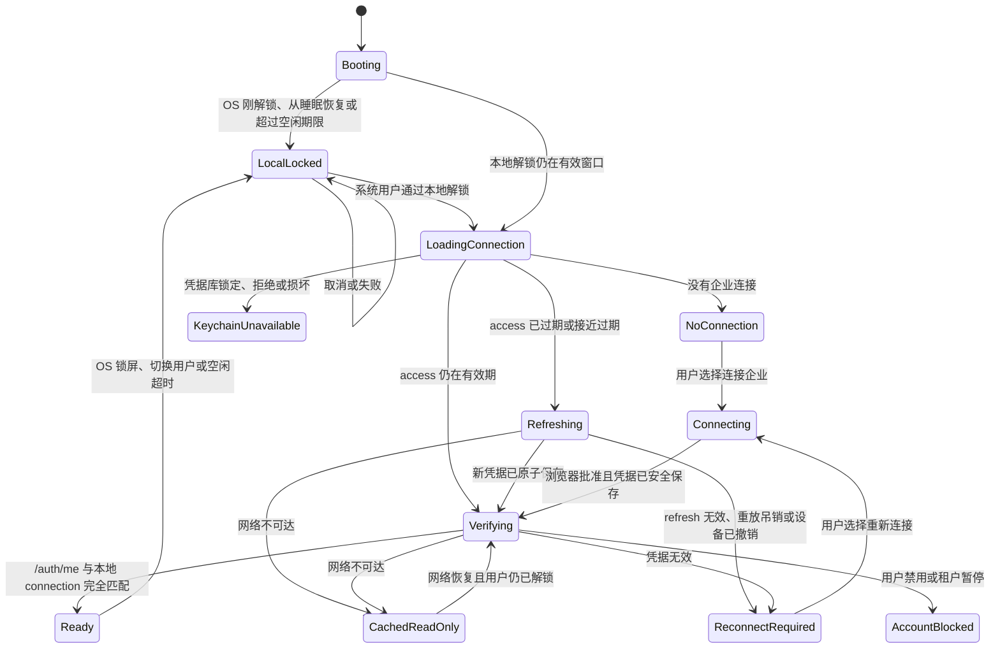

# ORYH AI Client 登录、认证与设备会话设计

服务端检查基线：ORYH `1ea1509`，2026-08-21。本章区分“当前已实现”和“客户端上线要求”；后者不能被误读为现有服务端保证。

## 1. 结论

ORYH AI Client 不采用“每次打开客户端都登录 ORYH”的产品模型。登录与认证拆成四个独立过程：

1. **ORYH 账号认证：** 在系统浏览器中由 ORYH 完成密码、SSO、MFA 或 Passkey；客户端不接触账号密码和浏览器 Cookie。
2. **设备连接授权：** 用户明确允许一个客户端安装实例以自己的当前角色访问一个 ORYH 企业；成功后形成可单独吊销的 `Connection`。
3. **本地客户端解锁：** 通过 Touch ID、Windows Hello 或系统凭据释放本地数据密钥和连接凭据；这证明当前有人获准使用本机，不等于 ORYH 重新认证。
4. **高风险操作 step-up：** 由 ORYH 服务端按动作要求认证强度和新鲜度；本地生物识别可以是附加控制，不能代替服务端身份语义。

因此，用户日常打开客户端的正常路径是“本地解锁 → 验证当前连接 → 进入我的工作”，而不是重复输入 ORYH 密码。只有首次连接、refresh token 无效、设备被吊销或服务端要求 step-up 时才打开系统浏览器；用户被禁用或租户暂停时进入阻断状态，不反复要求登录。

本设计的稳定决定见 [ADR-0005](adr/0005-separate-account-auth-device-grant-local-unlock-and-step-up.md)。

## 2. 当前 ORYH 实现检查

检查基线：`/Users/wtong/git/calwbiz`，2026-08-19。

主要源码依据：`app/api/device.py`、`app/web/routes.py`、`app/api/auth.py`、`app/api/deps.py`、`app/core/browser_auth.py`、`app/services/interactive_keys.py`、`app/api/workspace.py`、`app/models.py` 和对应 `tests/test_device_flow.py`、`tests/test_browser_auth.py`。

当前实现是“参考 RFC 8628 的自定义 device flow”，不是完整、可互操作的 OAuth Device Authorization Grant。ORYH 使用自己的 endpoint、响应状态和 `X-API-Key` 凭据语义；专属客户端可以通过适配器使用，但文档和 UI 不应把它宣称为标准 OAuth 客户端。

| 能力 | 当前实现 | 评估 |
|---|---|---|
| 账号登录 | ORYH 系统浏览器页面，账号密码不交给设备 | 方向正确；企业版仍需要浏览器侧 SSO/MFA/Passkey |
| 设备开始 | `POST /auth/device/start` 返回短码、批准地址、15 分钟期限和 5 秒轮询间隔 | 可用于首版；需限流、结构化客户端身份和机器错误码 |
| 设备批准 | 已登录用户查看短码和 `client_name` 后批准或拒绝 | 需显著显示企业、账号、角色、平台、版本、安装实例和授权后果；批准需 recent auth 与 CSRF/同源保护 |
| 凭据交付 | `POST /auth/device/token` 当前返回 access key、refresh token、到期时间、用户摘要、租户 name/slug 和 `install_dir` | 响应未直接返回稳定 tenant id/credential id；客户端必须随后以 `/auth/me` 核对稳定身份。并发轮询未证明严格单次消费，批准后过期也未清除待交付明文，真实企业发布前必须修复 |
| access 生命周期 | 个人 access key 默认 24 小时 | 可接受；客户端应提前刷新，不等待业务请求失败 |
| refresh 生命周期 | 每次同时旋转 access/refresh；旧 refresh 有 60 秒丢包重试窗口，窗口外重放会吊销设备 key | 符合 refresh rotation 方向；缺少 refresh 绝对/不活跃期限，客户端必须 single-flight 和崩溃安全保存 |
| 身份验证 | `/auth/me` 返回稳定用户/企业标识、员工、角色和当前权限 | 作为连接就绪的最终门槛；仍建议补充当前 `credential_id`、认证时间和服务端能力版本 |
| 多设备 | 每次批准创建独立 `device:<client_name>` key | 正确；不能只依赖可伪造的显示名称识别设备 |
| 自助设备撤销 | `keys.manage` 用户可管理租户 API keys；普通用户没有只管理自己设备的接口 | 产品阻断项；“断开连接”目前不能可靠完成服务端吊销 |
| 浏览器会话 | Cookie 为 Host-only、HttpOnly、SameSite=Lax，HTTPS 时 Secure；API 写入使用 CSRF token | API 浏览器认证基础良好；遗留 `/web/device/*` 表单还需统一同源/CSRF 保护 |
| 高风险 step-up | 当前无可供客户端消费的认证强度/新鲜度挑战 | B2/R4 阻断项；本地弹窗或生物识别不能补造服务端保证 |

### 2.1 必须优先修复的服务端问题

以下不是客户端可以自行掩盖的体验细节：

1. 批准后的 `DeviceAuthorization` 只有在客户端成功轮询后才清空 access/refresh 明文；当前 approved 分支没有再次检查过期时间，也没有发现后台清理。必须为待交付秘密设置强制短 TTL，过期即销毁。
2. “一次性交付”目前是读行、修改、提交的普通事务，未看到行锁或原子 compare-and-set。两个并发 poll 可能同时读取同一对秘密；需要 PostgreSQL 并发测试证明只有一个请求成功。
3. 普通用户无法列出、重命名或吊销自己的设备。现有 `/auth/logout` 以浏览器 `UserSession` 为撤销对象，不是 user-bound device key 的可靠撤销接口；客户端删除本地 Keychain 项也不等于服务端凭据已经失效。
4. device start、短码查询和 poll 需要独立限流；服务端应强制最小 poll interval，并返回 `authorization_pending`、`slow_down`、`access_denied`、`expired_token` 等稳定机器码或语义等价的版本化错误。
5. `/web/device/approve` 与 `/web/device/deny` 应统一进入同源/CSRF 守卫；设备批准必须要求近期账号认证，不能仅凭最长七天的旧浏览器会话静默签发新设备凭据。
6. 当前没有普通用户列出/吊销自身设备授权的完整接口；管理员 API key 管理不能替代本人设备生命周期。
6. token/device 响应必须带 `Cache-Control: no-store`，代理、访问日志、异常报告和 audit detail 都不得保存秘密。

## 3. 用户可理解的认证概念

产品文案不使用一个模糊的“登录/退出”覆盖所有动作。

| 产品动作 | 发生了什么 | 保留什么 | 不做什么 |
|---|---|---|---|
| 连接企业 | 在浏览器登录 ORYH，并给当前安装实例签发独立设备凭据 | 新 `Connection`、Keychain 凭据、企业元数据 | 不把浏览器 Cookie 或密码交给客户端 |
| 解锁客户端 | 系统确认当前本机用户，Host 释放本地密钥 | 企业连接和服务端授权都不变化 | 不向 ORYH 签发新 token，不代表 MFA |
| 锁定客户端 | 清理内存秘密、暂停 Agent、遮蔽业务内容 | Keychain 凭据和服务端设备授权保留 | 不断开企业 |
| 重新连接 | 旧设备授权不可再用，重新走浏览器 device flow | 可沿用同一逻辑 `ConnectionId`，凭据代际增加 | 不复用失效 refresh token |
| 断开企业 | 先吊销当前设备授权，再删除本地凭据 | 可按用户选择保留或删除本地历史数据 | 不退出系统浏览器中的 ORYH Console |
| 删除本地数据 | 删除该企业的 Session、缓存、草稿和索引 | 可选择继续保留设备连接 | 不删除 ORYH 服务端业务记录 |
| 浏览器退出 ORYH | ORYH Console 浏览器会话结束 | 桌面设备连接可继续有效 | 不应被客户端误称为“断开设备” |

## 4. 日常启动状态机



### 4.1 启动规则

1. 默认打开上次使用的企业，但在 `/auth/me` 成功前不启用业务写入、Agent 工具和 Skill 更新。
2. 验证期间可以显示加密缓存的壳层，但必须标记“正在验证”；不得把缓存冒充当前服务端事实。
3. 无网络时进入“离线缓存，只读”。只显示企业策略允许且已本地解锁的缓存；高敏感租户可以完全禁用离线内容。不自动建立写队列，不把离线状态显示为“已登录”。
4. 只验证当前活动连接；其他企业在用户切换或后台低优先级健康检查时惰性验证，避免启动时同时刷新所有企业。
5. `/auth/me` 返回的 origin、tenant id 和 user id 必须与本地元数据一致。任何不一致都冻结连接，不自动改绑。
6. 用户或租户被禁用时显示服务端状态与支持入口，不循环 refresh 或 device flow。
7. Renderer 在 `Ready` 前拿不到凭据、凭据引用、未遮蔽的敏感缓存或可执行写 Operation。

### 4.2 本地解锁默认策略

- 首次访问本地业务数据、OS 锁屏/切换用户后、从睡眠恢复后以及连续 15 分钟无客户端交互后要求本地解锁。
- 在同一已解锁窗口内关闭并重新打开主窗口，不重复要求 ORYH 登录。
- 使用系统提供的 Touch ID、Windows Hello、系统密码/PIN 回退；不实现一套客户端自有密码。
- 锁定时清除内存中的 access token、refresh 临时副本、数据解密 key、附件明文和模型请求缓冲，暂停正在运行的 Agent，并把通知降为无业务正文。
- 企业策略可以缩短空闲期限、要求每次启动解锁或禁止生物识别回退；不能要求客户端保存另一份可恢复密码。
- 技术验证阶段如果平台能力尚未完成，必须明确标记为测试模式并禁止真实企业数据，不能用普通 UI modal 模拟安全解锁。

## 5. 首次连接与重新连接

### 5.1 客户端步骤

1. 从官方固定 ORYH origin 或管理员下发的 allowlist 选择服务；私有部署地址必须是 HTTPS 并经过显式信任确认。
2. 客户端为安装生成随机 `installation_id`，不得使用 MAC 地址、磁盘序列号或其他稳定硬件指纹。
3. Host 调用 device start，提交官方 client id、产品名、平台、应用版本、用户可修改的设备名称和随机安装标识。服务端必须区分平台签名的字段与客户端自报字段。
4. 客户端同时显示 ORYH origin、短码、过期倒计时和“将在系统浏览器中批准”，然后打开 `verification_uri_complete`。
5. 客户端遵守服务端 `interval`，收到 `slow_down` 或网络超时时降低频率；用户取消、拒绝、过期或其他终止错误后停止 poll。
6. Host 收到批准结果后，把完整 credential bundle 作为一个 Keychain item 原子写入；Renderer 不接收响应秘密。
7. 保存成功后立刻调用 `/auth/me`，核对 origin、tenant、user、角色和权限；通过后才发布 `ConnectionReady`。
8. 用 `/auth/me` 的 tenant/user 稳定 id 补全本地 connection metadata；不得把 device token 响应里的 tenant slug 或 `install_dir` 当授权标识。
8. 保存失败时优先调用当前设备撤销 endpoint，再清空内存。若服务端撤销不可用，必须明确提示“服务端连接可能仍有效”，引导用户从 ORYH Console 吊销，不能显示为连接失败后已自动安全清理。

### 5.2 浏览器批准页

批准页必须让用户核对：

- 当前 ORYH 正式域名；
- 当前企业与账号；
- 当前角色，以及“该设备将继承角色的实时权限”；
- 官方客户端身份、版本与平台；
- 用户可读设备名、随机安装实例末尾和发起时间；
- 与客户端一致的短码和剩余有效期；
- 批准会创建可单独吊销的设备连接；
- 明确分开的“批准”和“拒绝”。

打开带短码的完整 URI 只能定位请求，不能自动批准。浏览器已有 ORYH 会话超过 recent-auth 窗口时，批准前必须重新进行密码、SSO 或 MFA。切换账号/企业只能在 ORYH 浏览器界面完成，客户端不得读取或操纵浏览器 Cookie。

### 5.3 多企业

- 一个 device approval 只创建一个 `(origin, tenant, user, installation)` 连接。
- 添加第二家企业需要再次走 device flow；浏览器若仍登录第一家，批准页必须高显著显示企业并提供“使用其他账号”入口。
- 连接完成后，工作空间与工具从 `/auth/me` capability 和 eligible Skill audience 计算；角色显示名和 device grant 本身都不授予额外业务能力。
- 本地连接主键使用随机 `ConnectionId`；tenant slug、邮箱和设备名都不是授权标识。
- 重新连接沿用原 `ConnectionId` 以保留历史 Session 归属，但递增 credential generation，并保留“何时、为什么重连”的非秘密审计元数据。

## 6. 凭据模型与刷新

### 6.1 Keychain 数据

每个连接保存一个不可部分更新的 credential bundle：

```text
CredentialBundle {
  version
  credentialId
  accessToken
  accessExpiresAt
  refreshToken
  generation
}
```

`ConnectionId`、origin、tenant/user 显示元数据和最近验证时间保存在加密本地数据库；真正的 credential bundle 只存在 OS Keychain/Credential Manager。Keychain adapter 的 `replace` 必须保证旧 bundle 或新 bundle 完整可读，不能出现 access 已更新而 refresh 仍旧的中间状态。

### 6.2 刷新算法

1. 在 access 到期前留出时钟偏差和短预刷新窗口，不让普通业务请求承担首次发现过期的责任。
2. 同一 `ConnectionId` 的所有调用共享一个 refresh single-flight；桌面应用保证同一数据目录只有一个 Host 实例。
3. 刷新响应到达后，先原子保存整个新 bundle，再唤醒等待请求。
4. 任意等待请求不得各自再刷新；一次业务请求最多经历一次刷新和一次重放。
5. refresh 响应丢失时可以在 ORYH 当前 60 秒 grace 内立即重试。若进程在服务端旋转成功、本地保存前崩溃并超过 grace，安全结果是要求重新连接，不能猜测或无限重试。
6. `invalid_refresh`、`refresh_replay_revoked`、`device_revoked` 使用不同机器错误码；客户端统一进入 `ReconnectRequired`，但给出准确原因。
7. 服务端应为 refresh grant 增加不活跃期限和绝对期限，并在密码重置、账号禁用、风险事件或用户撤销设备时使其失效。

### 6.3 后续增强

refresh rotation 已满足公共客户端检测重放的基本方向。企业增强可用 DPoP 或平台设备密钥把 access/refresh token 约束到安装实例，降低 token 被复制到另一台机器后的可用性；这需要 ORYH 服务端共同实现，不能只在客户端生成一把无人验证的本地 key。

## 7. 高风险操作的重新认证

业务风险等级 R1–R3 继续使用权限检查、业务预览、不可变参数摘要和一次性确认。R4 动作——付款、核销、账本、改角色、禁用用户、大批量导入——只有在 ORYH 提供服务端 step-up 后才开放：

1. 资源 endpoint 以稳定错误和 challenge 表明所需 `max_age`、认证方法或 assurance level；
2. 客户端在系统浏览器发起针对当前企业和动作的 step-up；
3. ORYH 返回短期、限定 audience/动作/租户的 assurance，而不是新的通用长期凭据；
4. Host 把 assurance 与原 action proposal、参数摘要、用户、connection 和到期时间绑定；
5. 参数、企业、用户、服务端版本或时间窗口改变后重新 step-up；
6. 服务端在最终写入时验证 assurance，客户端 UI 不能单独决定通过。

Touch ID/Windows Hello 可以在打开 R4 确认卡前要求 user presence，但它只能作为本地附加控制。服务端尚未支持 step-up 时，客户端不得把“已用指纹确认”描述为 ORYH 重新认证，也不得开放依赖该保证的 R4 动作。

## 8. 锁定、断开与卸载

### 8.1 断开顺序

“断开当前企业”执行以下确定性事务：

1. 停止该连接的新请求，取消安全可取消的读取并等待正在提交的 mutation 得到确定结果；
2. 使用当前设备凭据调用幂等的自助 revoke endpoint；
3. 服务端确认已撤销或 token 本就无效后，删除本地 Keychain item；
4. 清除进程内秘密和 Skill cache；
5. 询问是否同时删除该企业的 Session、草稿、附件缓存、视图和索引；
6. 保留不含秘密的最小断开结果，供用户确认和诊断。

网络不可达时不能声称“已安全断开”。默认提供“重试”和“打开 ORYH Console 管理设备”。用户仍可选择“仅从本机移除”，但界面必须警告服务端设备凭据可能继续有效；删除本地 secret 后客户端无法替用户稍后完成远端吊销。

### 8.2 自助设备页

ORYH 需要提供普通用户只能查看和管理本人设备的接口：

- 列表字段：稳定 device/credential id、用户设备名、官方 client id、平台、版本、创建时间、最近使用、access/refresh 到期、当前设备标记和状态；
- 动作：重命名、吊销单台设备、吊销其他所有设备；
- 服务端约束：只能操作当前用户的 user-bound device credentials，不能触及 service key、Hosted Flow Agent 或他人设备；
- 当前设备可以由 Host 用当前 refresh grant 调用幂等 self-revoke；无论 token 已撤销还是刚撤销都返回相同成功语义，并级联失效该设备的 access/refresh；
- 吊销其他设备或“其他全部”要求系统浏览器 recent auth。客户端可以展示列表和提供按钮，但不能仅凭一个长期 device token 静默清退其他设备；
- 审计：连接、刷新、重命名、吊销、重放吊销和重新连接均记录 actor 与 device id，不记录 token；
- 当前设备被远端吊销后，客户端下一次请求进入 `ReconnectRequired`，不静默创建新授权。

卸载器可以在联网且用户已解锁时提供“先断开所有企业”，但不能假设卸载一定有机会运行。因此，自助设备页和 refresh grant 过期仍是清理遗留授权的必要控制。

## 9. Renderer、Host 与浏览器边界

- 系统浏览器拥有 ORYH 账号会话；桌面 Renderer 不嵌入登录 WebView，不共享 Cookie jar。
- Renderer 只能调用命名的连接、解锁、验证和断开 Remote；不得拿到 access/refresh、Keychain handle 或任意 auth endpoint 代理。
- DSH `client-connection` 让启动 URL 的一次性 token 仅在 `GET /` 交换为 authority-bound HttpOnly 签名 cookie；Gateway Remote 再绑定窗口、用户解锁状态和当前 `ConnectionId`。
- 使用 loopback 时必须验证 Host、Origin、Content-Type、browser session 和 Remote schema；随机端口仅是减少冲突，不是身份认证。
- 锁定或窗口销毁时撤销 Renderer capability、订阅和未完成调用。
- device flow 的浏览器回跳不是必须条件；客户端以安全 poll 为准。未来增加 deep link 时必须验证一次性 state、目标 origin 和发起安装实例。

## 10. 后端实施优先级

### 10.1 真实企业发布阻断

| 事项 | 最小验收 |
|---|---|
| 原子一次性交付 | 两个 PostgreSQL 并发 poll 只有一个拿到秘密；另一个稳定失败 |
| approved secret TTL | 批准后超时未取即销毁；定时清理覆盖 pending/approved/denied/consumed |
| 当前设备自助 revoke | 普通用户可幂等吊销当前 user-bound device，不能吊销他人或 service key |
| 自助设备列表 | 仅返回本人设备；当前设备、最近使用和状态准确 |
| recent auth + CSRF | 旧浏览器会话批准前重新认证；approve/deny 经过同源和 CSRF 负向测试 |
| 限流与协议错误 | start、短码、poll 限流；客户端遵守 interval/slow_down；错误机器可判定 |
| 无缓存与无泄露 | device/refresh 响应 `no-store`；日志、audit、trace、异常中无秘密 |
| refresh 期限 | 绝对/不活跃期限、密码重置/禁用/吊销失效和客户端恢复 E2E |

### 10.2 企业增强

- 浏览器侧 OIDC/SAML SSO、MFA/Passkey 与企业身份策略；
- RFC 9470 风格的 R4 step-up challenge 和短期 assurance；
- DPoP 或其他 sender-constrained token；
- OAuth Authorization Server Metadata 与更标准的 device/token/revocation endpoint；
- 管理员设备合规、最小客户端版本和签名证明策略。

## 11. 需求追踪

| 需求 | 本文设计与主要验收 |
|---|---|
| FR-CONN-001、FR-CONN-014 | 系统浏览器 device flow、批准页核验、recent auth、同源/CSRF 和限流 |
| FR-CONN-002、FR-CONN-003、FR-CONN-013 | Keychain credential bundle、single-flight、原子替换和崩溃恢复 |
| FR-CONN-004、FR-CONN-011、FR-CONN-012 | `/auth/me` Ready 门槛、启动状态机、身份不匹配与离线缓存只读 |
| FR-CONN-005、FR-CONN-006 | 每企业独立 connection、惰性验证与 tenant-bound Session |
| FR-CONN-007、FR-CONN-008 | 当前设备先吊销后删除、本人设备列表和其他设备管理 |
| FR-CONN-009、FR-CONN-010、FR-CONN-015 | 日常打开、本地 user presence、锁定和四类安全动作 |
| FR-CONN-016 | refresh grant 期限与账号安全事件失效 |
| FR-CONN-017 | ORYH 服务端 R4 step-up challenge 和 assurance |

## 12. 测试矩阵

至少覆盖以下组合：

- 新安装、已有一个企业、已有多个企业；
- 正常启动、OS Keychain 锁定、取消本地解锁、OS 锁屏/睡眠/切换用户；
- access 有效、即将过期、已过期、refresh 无效、refresh 重放、设备被远端吊销；
- `/auth/me` 身份一致、tenant/user 不一致、用户禁用、租户暂停；
- 在线、启动时离线、refresh 响应丢失、服务端成功后本地保存失败、保存中崩溃；
- 两个并发业务请求、两个 Host 竞争、两个并发 device poll；
- 浏览器已登录正确企业、登录错误企业、旧会话需 recent auth、拒绝、短码过期；
- 断开成功、远端已吊销、断开时离线、只删除本地、卸载未运行；
- Renderer XSS、恶意网站访问 loopback、伪造 `client_name`、短码暴力尝试、日志和 crash dump secret canary；
- R4 challenge 成功、取消、过期、参数变化、跨租户重放和只做本地生物识别的拒绝路径。

## 13. 采用的标准基线

- [RFC 8252: OAuth 2.0 for Native Apps](https://www.rfc-editor.org/rfc/rfc8252.html)：原生应用使用外部 user-agent，不使用嵌入 WebView 收集认证信息。
- [RFC 8628: OAuth 2.0 Device Authorization Grant](https://www.rfc-editor.org/rfc/rfc8628.html)：短码、批准/拒绝、轮询间隔、`slow_down`、过期与短码限流。
- [RFC 9700: Best Current Practice for OAuth 2.0 Security](https://www.rfc-editor.org/rfc/rfc9700.html)：公共客户端 refresh token 使用 sender constraint 或 rotation，并限制 token 权限和生命周期。
- [RFC 7009: OAuth 2.0 Token Revocation](https://www.rfc-editor.org/rfc/rfc7009.html)：客户端断开或卸载时撤销不再需要的授权。
- [RFC 9470: OAuth 2.0 Step Up Authentication Challenge Protocol](https://www.rfc-editor.org/rfc/rfc9470.html)：资源服务表达认证强度和新鲜度要求。
