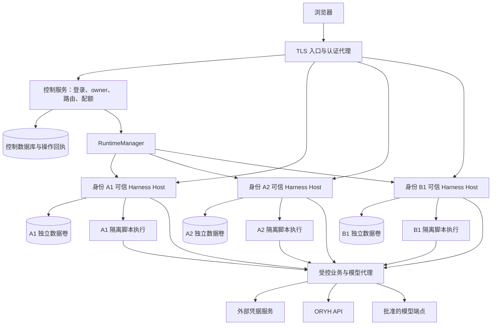

# ORYH AI Client 多租户服务器版实施方案

更新：2026-09-14。审阅基线：ORYH AI Client `48748eb`（已合入 Agent 主客户端及多租户方案更新）；Harness 本地参考 `c291e7961a`。实施时重新锁定实际提交、依赖及补丁，不将本次源码审阅视为运行验证。

状态：服务器版正在 `codex/multi-tenant-server` 分支实施，当前主要是已测试的隔离与接入原型，尚未达到完整应用部署条件。用户已授权推进到测试部署；当前结果、外部依赖和客户端剩余工作见[部署状态](31-server-deployment-status.md)。本文保留目标方案，不把规划项视为已实现。

关联：[技术架构](04-technical-architecture.md)、[认证](09-authentication-and-login.md)、[插件迁移](14-dsh-plugin-migration.md)、[S0 验收](21-s0-acceptance.md)、[Skills 装载](23-oryh-skills.md)、[用户菜单](24-user-menu-views.md)、[Agent 主客户端](26-agent-primary-client.md)、[ADR-0010](adr/0010-agent-is-the-primary-client.md)。旧文档中的版本、接口数量和桌面限制以对应历史基线理解。

## 1. 目标、决策与非目标

一个对外产品实例同时服务多个 ORYH deployment、tenant 和用户。用户通过浏览器登录，自动进入自己的 Workspace，使用原生 Harness Chat 与 ORYH 业务视图。Agent 是主客户端：查询、填写、创建、提交、审批按 Skills 完成，传统页面是辅助视图和编辑入口。

服务器版采用以下规划决策：

- **共享入口、每身份可信 Host 与独立执行容器。** `(oryhDeploymentId, tenantId, userId)` 为 runtime owner；每 owner 独立 Harness Host、HOME、技能快照及数据根，租户脚本通过公开 Shell provider 在另外的执行容器中运行。一个应用实例由入口、控制服务和多个运行单元组成，不承诺所有运行单元位于一个容器。P0 方向和实测边界见 [ADR-0011](adr/0011-server-trusted-host-and-isolated-shell.md)。
- 一个身份可有多个 Workspace、每个 Workspace 可有多个 Session。Workspace 不承担跨用户安全隔离，同身份内部也不承诺 Workspace 间强隔离。
- Skills 保留；服务器业务优先通过 MCP 调用，Bash 仅在确需脚本时启用，启用后的执行环境按可运行任意租户代码设计。禁止用户安装任意插件、修改受信 Profile、连接任意 MCP 或注册服务器任意目录。
- **执行环境不持有真实业务和模型凭据。** 凭据及授权代理部署在其外部；文件或环境变量供同权限 Bash 读取的方案不作为服务器版选项。
- 身份、权限、确认凭证和执行代次由可信服务验证。提示词、技能持有人文件、隐藏菜单均不构成安全边界。
- 复用 Harness 的 Profile、Session、Agent、Composer、模型、approval、Slot、store、Connection、Gateway/Remote 和生命周期。产品只使用公共包入口，不导入私有源码，不重建聊天或业务应用框架。
- runtime 按需启动、空闲回收，注册人数不等于常驻 runtime 数；从原型期设置资源和并发限制。

首版非目标：跨用户共享 Session、团队共享文件夹、插件市场、后台自主审批、多节点高可用、无损接续被终止的模型推理、直接访问 ORYH 业务数据库、自动迁移桌面凭据与聊天。

## 2. 当前基础与未验证事项

| 当前事实 | 服务器版要求 |
| --- | --- |
| Host/Client/Profile 已按外部插件组合；Host 有 `developmentOnly` 限制 | 新建经过验证的服务器组合，不能只删除限制 |
| Agent 通过 Skills/Bash 写入，不经过页面的意图状态机 | 保留该业务入口，补充通用授权、操作回执及恢复契约 |
| 技能持有人信息进入提示上下文；工具执行检查允许列表 | owner 由可信运行环境建立，请求不能借用其他身份 |
| 技能安装逐目录删除、逐文件写入 | 不可变版本、原子发布、运行任务固定版本 |
| Bash 回合结束触发 Session 级 `serverChange` | 同身份多页面同步，并覆盖其他用户和后台任务的服务端变化 |
| 原生 Session、用户菜单及偏好已有存储基础 | 验证 owner/Workspace 归属、服务器持久化和并发版本 |
| ORYH 有授权码 + PKCE、不透明令牌与刷新轮转 | 验证服务器回调、membership、撤权和委托执行全链路 |
| ORYH main 已有 OAuth MCP：prompts 交付 Skills，resources 交付参考 Markdown，tools 复用 REST；ZIP 仍是带 key 的另一交付方式 | 服务器默认采用 MCP，无需等待新增无凭据 ZIP API；客户端须补齐技能读取、OAuth 生命周期和可信确认集成 |

源码依据：客户端 `packages/core/src/skill-bundle.ts`、`packages/dsh-host/src/business-chat.ts`、`packages/web/src/client/command-stream.tsx`；相邻 ORYH 仓库 `app/api/mcp.py`、`app/services/delivery.py`、`app/api/bundles.py`、`app/api/deps.py`。2026-09-14 已核对 main 与 origin/main 同为 `2e1c4b51`；详见 [MCP 接入复核](28-server-mcp-skills-review.md)。部署版本必须另行核实。

当前桌面版的技能正文/脚本可能包含个人 API key，加载后会进入模型请求和 Session。这是已知现状，不能作为服务器版例外。服务器版不导入这类包或历史记录。已有记录的清理、凭据轮换与桌面迁移另列任务。

P0 尚须验证：受保护代理下完整原生 UI、全部 Remote 的归属、公开接口能否连接受控执行与确认、运行生命周期及隔离、无凭据技能契约、业务幂等与恢复。找到一个公开包不代表以上组合已经可用。

## 3. 总体结构与信任边界

图中连线表示经过策略允许的通信，不表示互通网络。浏览器业务请求仍使用原生 Remote；代理是执行基础设施，不新增一套领域 HTTP API。登录、企业选择、启动状态可以有最小入口页面，不扩展为第二套业务应用。

控制服务、每身份 Harness Host、凭据代理及编排接口为可信区域。独立执行容器内的脚本、Workspace 文件和模型生成内容按不可信处理；控制服务不信任该区域自报的 owner、确认结果或 generation。Host 的 Profile、插件、Session 和内部认证材料不得挂入脚本容器；所有可执行代码和 Host 文件访问入口都需审计，不能只替换 Bash 就宣称完成隔离。模型请求经批准的代理通道发送，模型 Key 不写入 runtime 配置。

## 4. 身份、登录与请求路由

### 4.1 登录与技能授权契约

1. 控制服务建立一次性 OAuth 事务，保存 state、PKCE verifier、有效期和校验后的返回地址。
2. 浏览器前往批准的 ORYH 部署授权；回调验证事务并一次性消费，由服务端交换令牌。
3. 调用权威身份接口获取稳定 user/tenant/employee 信息。不假设 OIDC，不从不透明令牌推导 JWT claims，不接受浏览器拼出的 membership。
4. 创建 Principal：`principalId`、`oryhDeploymentId`、`tenantId`、`userId`、可空 `employeeId`、授权版本及验证时间。
5. 浏览器只取得 AI Client 登录 Cookie（HttpOnly、Secure、适当 SameSite）。状态变更接口验证 CSRF/Origin；登录凭据不进入 Session 或工具参数。
6. 由同一委托身份连接 MCP，发现 tools、prompts 和 resources；按需读取无凭据技能，创建默认 Workspace、启动 runtime。

S0-3/S0-4 必须共同验证：登录 → membership → MCP 技能获取 → 同身份查询/可信确认写入 → ORYH actor 审计 → 撤销生效。ORYH main 已提供 MCP 无凭据技能交付，不再将 ZIP 接口列为外部阻塞。当前 Harness MCP 插件仅桥接 tools，prompts/resources 读取与 OAuth 生命周期属于客户端待集成项；不能以静态 header 接通代替完整登录验收。

### 4.2 Tenant 切换与浏览器会话

自然人跨 tenant 的关系以 ORYH 为准；不能枚举 membership 时分别授权。每个标签页绑定明确 owner 的 runtime 句柄，不使用全局“当前 tenant” Cookie 改变所有标签页路由。已有 Session 不随企业选择迁移，首版禁用跨企业复制聊天。

注销当前浏览器与撤销整个身份委托须区分：前者使该登录会话和连接失效，后者同时阻止 runtime 后续委托请求。关闭页面不等于取消任务；显式取消也不能撤销已经到达 ORYH 的写入。

### 4.3 认证代理与浏览器隔离

- runtime 只监听私有 socket/受控网络地址，不发布公网端口。内部启动凭据不作为用户登录链接分发。
- 每个 HTTP 请求、WebSocket 握手、流式订阅、文件下载和取消请求验证登录主体及资源归属；长连接还要处理到期和撤权。
- 剥离外部身份头；只路由到登记目标，不接受任意 URL、端口或文件路径。用户可见句柄本身不是访问权限。
- P0 比较路径前缀与子域，验证入口、boot manifest、bundle、Cookie、Location、WebSocket、深链和下载，选择一种有证据的组合。子域使用 host-only Cookie 和受控引导票据，不使用宽域 Cookie。
- 路径前缀不是浏览器安全边界。用户生成的 HTML/SVG 等活跃内容不得以应用可信源直接执行；采用独立无应用凭据的附件源或强制下载，预览需受限沙箱并验证不可访问父页。
- 两种代理方式均需私有 Harness 修改才能工作时，先解决上游公开支持，不以零散重写补丁上线。

## 5. Workspace 与执行隔离

### 5.1 归属与目录

层级：`deployment → tenant → user → workspace → session`。Workspace 使用服务端不透明 ID 分配路径；不能直接使用邮箱、用户输入或业务编号拼路径。创建与注册均经公开接口并验证 owner，原生任意目录注册入口必须实际拒绝，不仅隐藏按钮。

每 owner 独立 HOME、`DSH_HOME`、`DSH_AGENTS_HOME`、临时目录和持久卷；同身份多 Workspace 不承诺相互隔离。所有资源关系带 owner，随机 ID 不能替代授权。若使用 RLS，采用事务级身份并测试连接池复用，应用层仍验证归属。

### 5.2 生命周期与旧任务失效

状态：`stopped → starting → ready → draining → stopped`，失败进入 `failed`，重试有退避和上限。RuntimeManager 提供 `ensureRuntime(owner)`、`resolveRoute(subject, handle)`、`drainRuntime(owner)`、`reconcileRuntime()`。

从首版就记录 owner、generation、租约、状态和最后活动时间，并保证一个数据根只有一个写者。空闲判断覆盖模型推理、工具、后台子进程、上传、等待确认和结果核对，不能只看浏览器连接或 Agent 的 idle 状态。

回收先停止接单，再排空或中止整个任务进程树，撤销旧代次的代理访问。代理在每次实际转发前验证有效 owner/generation；旧进程即使仍存活也不能继续发送新业务请求。已经发出的请求可能完成，按 §6.4 核对，不宣称 fencing 可以撤回它。多 worker 扩展时增加分布式租约，不推迟首版的旧代次拒绝要求。

### 5.3 执行与网络边界

默认每身份独立执行容器，使用非特权运行、最小 capabilities、受控只读基础文件、独立进程/挂载/网络边界及资源限制。rootless、user namespace、额外沙箱等具体选择由目标平台验证；不能仅凭不同 uid 或 Docker 默认配置宣称完成隔离。

必须拒绝：其他 owner 的卷和进程、宿主敏感路径、容器引擎 socket、编排接口、控制数据库、凭据服务直连、云 metadata、其他 runtime 内部端口。执行侧只访问批准的代理出口；目标地址、DNS/重定向及上传下载路径均须受控。运行所需依赖在构建期准备，不能默认开放任意互联网出口。

Profile 限制属于纵深防护，仍审计 Session、Workspace、插件、文件、导出、模型设置和所有 Remote。模型参数不能恢复禁用能力。可信 Profile/插件不可被 Bash 改写后重新加载。

CPU、内存、PID、磁盘/附件、工具时长、后台任务、网络请求和模型预算均有 owner/tenant 限额。某租户超限不得耗尽其他租户最低可用资源；具体并发上限由容量试验确定。

## 6. 存储、凭据与执行可靠性

### 6.1 数据分工

| 数据 | 存储与归属 |
| --- | --- |
| Principal、登录、membership、runtime 租约、Workspace 索引 | 控制数据库；ORYH 是身份与权限事实源 |
| Harness Session、原生日志与设置 | Harness 支持的持久化后端及每 owner 独立目录，不复制成另一套 Session 内容库 |
| 页面草稿、意图和核对状态 | 服务器事务存储适配器，保留现有版本及 prepare/confirm/reconcile |
| 通用执行回执和确认凭证 | 执行区域之外的可信存储，与 Session/operationId 关联；不是业务流程引擎 |
| 技能包 | 每 owner 不可变、只读版本目录；不得含凭据 |
| 用户菜单、列/查询/布局偏好 | 复用 Harness 存储域及已有适配接口，按 owner/Workspace/view 保存并处理版本冲突 |
| 附件 | 隔离持久卷或鉴权对象存储；下载和预览按 §4.3 |
| 正式工时、项目、库存等业务事实 | ORYH，仅经 API 访问 |

建议逻辑记录：`principals`、`login_sessions`、`workspaces`、`runtime_leases`、`credential_refs`、`model_profiles`、`operation_intents`、`execution_receipts`、`approval_grants`、`audit_events`。物理表在 P0 后确定；显示偏好、Session 等已有存储不重复建设。

### 6.2 凭据与受控代理

业务优先复用公开 DSH MCP 工具桥接，连接由可信 Host 持有，OAuth 凭据在可信服务管理；需要凭据代理时使用受控连接，不另建模型可配置目标的通用转发器。prompts/resources 通过外部插件的窄适配加载，不导入 Harness 私有实现。MCP 通用写入工具仍必须经过可信确认和回执边界，不能绕过页面操作的相同约束。

CredentialVault 在执行环境之外，使用成熟加密方案和外部 KMS/Secrets，记录 key version、轮换与恢复方法。真实 ORYH access/refresh token、API key、模型 key、控制服务密钥均不进入执行容器、浏览器、模型输入、Session 或普通日志。

代理依据可信工作负载连接绑定 owner/generation，不采信脚本自报身份。可采用私有 socket/独立 sidecar 等方案，但身份材料必须留在不受脚本控制的边界外；不能把真实 key 换成可导出且不受约束的代理 bearer token。脚本只得到执行结果，代理不返回 key。

代理校验部署/模型端点、目标路径与权限范围，剥离脚本提供的认证头，禁止任意目标及重定向携带凭据。策略须覆盖全部业务访问；只读试点不能仅凭 HTTP 方法或 Skill 名称判断权限。未知或无法安全分类的操作默认拒绝，登记契约后开放。业务字段校验和角色权限仍由 ORYH 负责，不在代理复制领域规则。

当前 ORYH 使用 URL client_id 和 PKCE，没有独立 scope 或动态注册契约；owner 取自 `/auth/me`，不接受浏览器自报 tenant。OAuth metadata 没有撤销端点，本地注销与远端授权撤销须分别验收。

刷新使用按委托身份的锁和凭据版本；刷新与撤销竞态不能复活旧授权。定义并测量注销、撤权、角色变更的生效时限；代理缓存不能无限延长有效权限。

模型配置支持批准的 base URL、model、企业默认及按策略允许的个人覆盖。Key 只写入可信凭据入口，后续仅返回已配置状态；模型代理使用 owner/tenant 预算。模型请求本身可能含业务数据，端点策略和数据保留要求独立于凭据防泄漏。

### 6.3 技能版本与并发同步

服务器采用 MCP 按需读取技能正文和参考资料，目录、正文与缓存按可信 owner 隔离。当前 ORYH 不发送 listChanged 通知，登录、重新授权和任务开始时刷新目录；读取拒绝时清除可用性缓存，不回退到另一身份或离线旧授权。

记录实际使用的 prompt/resource URI、内容 hash 和读取时间用于审计。当前接口不提供跨多次读取的原子快照，不能把本地 hash 称为服务器 bundle version，也不能声称同一任务所有参考资料来自同一版本。如业务需要严格版本一致性，再增加服务端 revision 契约。

固定已读取内容不固定权限：每次业务请求仍由 ORYH 校验。仅在启用离线文件或脚本交付时，保留暂存校验、完整 manifest/bundle 一致性、原子发布和任务版本引用；这些机制不再是普通 MCP 业务的前置条件。

### 6.4 写入、幂等与崩溃恢复

页面保留现有意图状态机，Chat 继续按 Skills 调用业务。两条路径的正式操作均接入通用执行回执；不通过解析 Bash 命令文本猜测业务行为，也不由模型自行声明操作已确认或已成功。

回执至少记录：可信 owner、Workspace/Session、run、generation、技能内容引用/hash（文件交付时含 bundle version）、operationId、规范化请求摘要、目标操作、确认关联、ORYH request/resource ID、状态与时间。审计避免保存完整敏感载荷；确需恢复的载荷按 owner 加密并设置期限。

状态至少区分待确认、可执行、已发送、成功、明确失败、结果待核对、取消。发送前持久化执行标识；响应丢失或崩溃后只在服务端能证明结果时定为成功/失败，不能默认失败重发。

要求 ORYH 为创建、提交、审批等实际开放操作提供经验证的幂等或等效唯一业务约束：同 owner/operationId/请求摘要复用结果，相同 ID 不同摘要拒绝。批量请求采用批次及逐项 ID，恢复只核对未确定项。代理有记录并不等于服务端幂等，“回读没有找到”也不足以防止并发重复创建。

不支持幂等/结果查询的操作，首版禁止自动重试，明确待人工核对；高风险或无法核对的写入不纳入首批支持范围。不同 Session 使用不同 operationId 的重复业务，由 ORYH 唯一约束、乐观锁及业务状态处理，不能宣称请求幂等解决所有重复单据。

重启恢复历史和待核对状态，不自动续跑被中断的模型回合。取消、注销和回滚均不能撤回已发生的业务事实。

## 7. 确认、权限与页面联动

### 7.1 对话主导与可信确认

保留 ADR-0010 的 Chat 主入口，不新增“必须打开业务页确认”的要求。业务规范及何时需要用户同意由 Skills/ORYH 策略定义；服务器若承诺“未经确认不能写入”，必须有模型无法签发的确认凭证，不能以自然语言历史代替强制校验。

规划方案：Agent 展示待执行事实，在 Chat 内使用 Harness 原生 approval 的可信用户响应；授权记录在执行区域外绑定 owner、Session、具体请求摘要、有效期和一次性消费。用户只确认一次，页面入口可产生同等绑定的授权；模型工具只可提出请求，不可批准自己。内容变化、身份切换、过期、重复消费均拒绝，执行时重新验证权限与业务状态。

已检查公开包 `@deepseek-ai/dsh-user-approval` 的一次性决定及缺少 answerer 时拒绝语义，以及 `@deepseek-ai/dsh-tool-bash` 的公开依赖。**这些能力尚未证明可构成业务授权**：P0 必须验证可信用户响应如何从原生 UI 经可信 Host 到达外部代理、绑定准确请求并防止执行容器伪造。已按 [ADR-0011](adr/0011-server-trusted-host-and-isolated-shell.md) 验证公开 Shell provider 的前台容器执行机制；真实确认链路仍未通过。命令批准不是单据批准，任意沙箱放行也不能当业务同意。

这是服务器版对 ADR-0010 中“仅按 skill 对话确认”的保证补充，须以服务器确认 ADR 固化后实施；不改写桌面既有行为。若公开扩展点无法实现，停在 P0 解决上游支持或重新评审支持范围，不能静默降级为提示词后宣称安全保证成立。

### 7.2 权限与审计

授权链：登录 → membership → 资源归属 → 委托 scope/ORYH 权限 → 单据状态与版本 → 必要确认。Session 的列举、读取、导出、订阅、取消均验证归属；菜单和技能目录只决定可发现性，不代表 API 授权。

服务端当前部分读取接口只有 tenant 隔离，不能假设全部都有细粒度查看权限。P0 输出实际接口权限清单；不满足试点要求的接口由 ORYH 补齐或从支持范围排除。试点读权限和写权限必须直接请求 API 验证，不能只移除写入 Skills。

ORYH actor 审计是业务事实证据，代理回执提供 operationId/requestId 关联，Session 为交互证据。三者可追踪但不互相替代；业务日志不保存令牌。失败与结果不明不得表述为业务成功。

### 7.3 Chat 与业务页面持续同步

当前 Session 级 Bash 完成标记仅作兼容提示。首版增加同 owner 各 Session/标签页的失效通知，并在重连、页面重新激活时查询服务端；没有可靠事件接口时采用有界轮询并公开刷新时限，不宣称实时同步。

跨用户场景必须覆盖员工提交后经理的审批队列、其他 ORYH 客户端修改、后台脚本在回合结束后写入。优先由 ORYH 提供提交后可靠事件/outbox，按资源和当前授权过滤后通知订阅者；不能向全 tenant 广播业务内容。事件携带资源版本或游标，丢失/断档时全量重读。权威状态来自 API，通知只是失效提示。

页面向 Chat 提供有版本的当前视图、查询、选择和草稿上下文；Agent 使用前读取最新上下文，不把旧聊天当当前页面。上下文仍是业务数据，不是可提升权限的指令。

未保存修改不得自动覆盖：标记服务端已变更，提供刷新/核对；保存采用版本冲突检查。命令具有绑定代次和 ID，重连不重复执行；同 Session 首版采用单主动表单编辑者或明确冲突策略。

## 8. 改造分工与外部依赖

| 责任范围 | 工作 |
| --- | --- |
| server/control | 登录、owner、可信确认及回执、RuntimeManager、路由和配额；不复制领域 API |
| 受控代理/执行基础设施 | 凭据注入、网络出口、工作负载身份、generation 拒绝、操作结果记录及模型计量 |
| `packages/core` / store | 保留 local 组合，增加服务器适配；原子技能快照、持久化和并发版本 |
| `packages/dsh-host` | 可信 owner、原生公开审批接入、原生 Remote 策略、页面上下文与通知；不得简单删开发限制 |
| `packages/web` | 复用 Harness Chat/Composer/Slot，自动 Workspace、企业选择、同步与冲突状态 |
| `packages/dsh-bundle` | 独立服务器 Profile；技能 registry/原生 skill 工具保持由 agent preset 组合；MCP Provider 挂入其作用域，按需启用隔离 Bash，不在 host plane 重开遮蔽 catalog |
| ORYH | 已有 OAuth/MCP 技能契约的部署核实；逐 API 权限、委托撤销、幂等/结果查询联调，必要时补版本及资源事件 |
| 运维/测试 | 镜像锁定、执行隔离、限额、故障注入、备份/恢复、容量与试点证据 |

所有名称是职责而非预先承诺的新包。业务规则继续留在 Skills/ORYH；传统 UI 与 AI 使用相同业务契约及权限，不强行将所有脚本重写成客户端专用工具。

## 9. 分阶段实施步骤

阶段：`P0 → P1 → P2 → P3 → P4 → P5 → P6`。每阶段保留本地版回归。P0 允许最小验证原型；其后将已通过原型产品化，不能把关键架构问题推迟到容器化阶段。

| 阶段 | 实施步骤 | 交付与退出条件 |
| --- | --- | --- |
| P0 / S0：契约与隔离原型 | 锁定构建和公开接口；尽早对接 ORYH；先跑单身份登录→技能→Chat 查询/可信确认写入→回执→撤权，再跑四身份、代理、容器、故障注入 | [S0 全部验收](21-s0-acceptance.md)通过；明确代理、隔离、确认及恢复 ADR；OAuth/MCP、确认与隔离未验收不得进入 P1，不因旧 ZIP 路径阻塞 |
| P1 / S1：登录与凭据产品化 | OAuth 事务、Principal/membership、Cookie/CSRF、Vault、刷新锁、业务/模型代理身份绑定、撤销 | 重放回调、伪造身份、并发刷新、撤权竞态测试通过；真实凭据不进入执行区域 |
| P2 / S2：runtime 与路由 | 每 owner 容器、持久根、受限 Profile、按需启动、generation、进程树排空、资源排队、HTTP/WS/流/下载代理 | 四身份不能互访；多标签页只创建一个 runtime；旧代次不能发送新业务请求；全部管理入口受控 |
| P3 / S3：持久化与可靠执行 | 默认 Workspace、原生 Session 存储、页面意图适配、通用回执、可信确认、幂等核对、原子技能版本、附件与偏好版本 | 换浏览器/重启恢复；确认内容不可篡改；响应丢失不盲目重发；安装中断不破坏已发布版本 |
| P4 / S4：业务与同步 | 可信 owner 注入现有领域服务；Chat/页面共享契约；跨 Session 及跨用户刷新；模型设置与计量；撤权和并发编辑 | 工时/项目/审批等支持范围逐项回放；经理队列可感知提交；脏表单不丢；模型 Key/额度不串身份 |
| P5 / S5：部署与运行保障 | 固定镜像、就绪检查、监控、SIGTERM、代理超时、磁盘满/数据库故障、容量与恢复/回滚演练 | 产出固定规格并发上限、RPO/RTO、保留策略、运维手册；不是此阶段才决定执行容器 |
| P6 / S6：试点 | 独立测试 tenant 后小范围灰度；用服务端权限限制首批操作；逐步开放经验证的写入和审批 | 无跨身份泄漏/重复业务，阻断项关闭，支持矩阵和回滚路径明确 |

外部接口等待期间可继续带测试凭据的隔离原型、接口清单和存储设计。Mock 只能证明内部机制，不能替代真实 ORYH 联调或作为 P0 已通过的证据。所有真实写入测试限独立测试租户并先明确授权范围。

## 10. 验收矩阵与容量

测试至少使用 A1、A2（同租户）、B1（与 A1 同自然人但不同 tenant）、B3，再加入撤权及未绑定员工身份。

| 场景 | 必须结果 |
| --- | --- |
| 跨 owner 的 Session/Workspace/附件 ID、订阅、取消、导出 | 拒绝，错误不泄漏资源内容或存在性 |
| 伪造 tenant、身份头、manifest 持有人、runtime 句柄 | 不能改变可信 owner；不匹配快照拒绝执行；直接脚本绕过提示仍无法冒用 |
| Bash 访问其他卷、进程、内部端口、metadata、控制 API | 底层拒绝；不以模型拒绝执行作为通过证据 |
| 脚本读取配置/环境/进程，任意目标请求或重定向 | 得不到业务/模型/控制凭据，不能将代理变成开放转发器 |
| 用户生成 HTML/SVG、下载链接复用 | 不在应用可信源执行，不绕过 owner 鉴权 |
| OAuth 登录但无 API key | 按正式契约完成无凭据技能获取和同身份委托调用 |
| 模型伪造确认、过期确认、修改载荷、再次消费 | 可信授权层拒绝；真实 Chat 用户确认无需业务页 |
| 服务端写入成功后丢响应、批量部分完成、并发重试 | 回执待核对；同 operationId 不重复生效；明确不支持项不自动重试 |
| runtime 崩溃、后台任务存活、新代次启动 | 旧代次不再发请求，已发送请求核对；一个数据根单写 |
| 技能更新中断、两次同步并发、运行中撤权 | 仅完整版本可发布；任务固定版本；撤权立即按约定时限生效 |
| A1 提交、A2 经理已打开队列，外部 ORYH 修改 | 授权页面在约定时限内更新；其他租户无内容泄漏 |
| 两标签页改同一表单、重连重复帧 | 明确冲突，不静默覆盖，不重复命令；未保存修改保留 |
| 模型不可用或预算耗尽 | 页面查询/编辑仍可用；依赖模型核对的操作明确阻止，不绕过规范 |
| 注销/撤权及并发刷新、长连接仍在线 | 拒绝新请求并使连接按策略失效；不恢复撤销凭据 |
| 数据/密钥恢复、旧版回滚 | 历史与回执可核对；不重放已完成业务，不自动迁移桌面含 key 历史 |

容量在固定目标服务器上测 4/10/20 活跃身份，分别运行页面查询、流式 Chat、Bash/后台任务和混合负载。记录空闲/活动 RSS、CPU、PID/fd、磁盘、连接、启动时间、队列、P95 查询、模型费用和故障恢复时间；超预算停止加压。区分浏览器在线数、活跃 owner 数和运行任务数。

P0 得出资源基线和限额可执行证据，P5 确定上线规格。单次 macOS 空闲测量不能外推服务器容量；控制、代理、执行容器和模型预算分别计算，保留故障余量。

## 11. 部署、升级与回滚

部署单元：TLS 入口、控制服务、凭据/业务/模型代理、每身份执行容器、控制数据库、独立持久卷和密钥服务，以及外部 ORYH。首版可单机部署，但不是单容器，也不宣称高可用。编排权限只授予受信管理服务，执行容器不得挂载 Docker socket。

配置包括允许的 ORYH 部署、OAuth 回调、代理路由、密钥引用、服务器 Profile、镜像/技能版本、运行时/任务/模型限额、附件限制、保留期限及通知时限。运行期不安装 npm 包或应用源码补丁。任何上游生成补丁必须固定 hash、责任人和更新验证方法。

升级顺序：停止接单 → 排空或明确中断工具及后台任务 → 撤销旧代次 → 备份控制状态/原生持久化和密钥恢复元数据 → 迁移并启动新版本 → 验证登录、会话、回执核对和业务查询 → 分批恢复流量。

备份加密且有访问审计；分别规定 Session、附件、回执、日志及凭据的保留期限，运行定期恢复演练。撤销访问和物理删除分开处理，备份中删除时限也须明确。回滚兼容数据库、Harness Session 格式、技能协议及密钥版本；无法读取旧数据时使用验证过的恢复点或向前修复，不只切镜像。ORYH 已发生的业务不随应用回滚。

扩展到多 worker 时保持 owner/generation、长连接稳定路由和单写者语义，禁止随机把同一 runtime 请求分到多个进程。

## 12. 决策清单与估算

| 决策 | 默认/要求 | 定案时点 |
| --- | --- | --- |
| 产品与部署 | 一个入口，每身份可信 Host + 隔离脚本执行，控制/凭据在外 | 本方案；P0 验证具体平台 |
| 路径前缀或子域及活跃附件源 | 选经过原生完整性及浏览器隔离验证的一种 | P0 |
| OAuth、MCP 技能与委托 actor | 单身份完整链路，无管理员 key 替代 | P0，Client 集成及 ORYH 部署联调 |
| 凭据来源 | 外部代理，不提供给执行脚本的文件/环境变量 | 本方案；P0 验证不可导出 |
| 必要确认 | Chat 内可信用户响应，绑定请求；无法实现则停，不降级承诺 | P0，服务器确认 ADR |
| 幂等/结果查询 | 逐实际操作验证，缺失项限制开放与重试 | P0，ORYH 契约 |
| 技能版本 | 原子发布、任务固定版本、权限实时校验 | P0 原型 / P3 产品化 |
| 通知方式与时限 | 同身份通知 + 重连/激活重读；跨用户事件或有界轮询 | P0 契约 / P4 验收 |
| 默认 Workspace | 自动一个，模型支持多个，同身份内部非强隔离 | P3 |
| 个人模型配置 | tenant 策略控制，端点与 Key 均受代理管理 | P4 |
| 权限失效、保留、RPO/RTO、上线并发 | 部署方明确数字，实测验证，不默认永久或无限 | P0 定测试值 / P5 定上线值 |

P0 报告记录每项负责人、外部依赖、证据、未解决项及重新验证条件。工作包按 §9 提交，估算在 P0 后按实际改造面更新；不预先把公开扩展点、代理和凭据契约当作已解决。

## 13. 完成定义

真实多租户多用户从同一入口进入自己的 Workspace；原生 Harness 与 ORYH 能力具有服务端归属与权限保证；Chat 可独立完成支持范围内业务，必要确认在对话内可靠完成；凭据不进入执行环境、模型或 Session；页面跟随本人与有权查看的其他用户写入；并发、断线、撤权和恢复结果可预测；技能更新不破坏运行任务；容量、备份和回滚有实测证据。

建立不同目录、多用户能登录或容器启动成功，均不单独构成完成。本文及 S0 的全部新增要求目前是待实施、待验证项。

## 2026-09-15 服务器选择要求

支持国际站 `oryh.ai`、国内站 `oryh.cn`、测试环境及任意独立部署。服务器 origin 是连接及 owner 的组成部分，不能硬编码为某个官方站点。桌面用户可以直接输入地址；共享服务器模式使用管理员配置的可连接列表，独立部署者可以自行配置自有域名。登录事务固定所选 issuer，后续换站点不重定向已有凭据。具体实现、使用边界与后续界面工作见[服务器地址配置](32-server-connections.md)。
