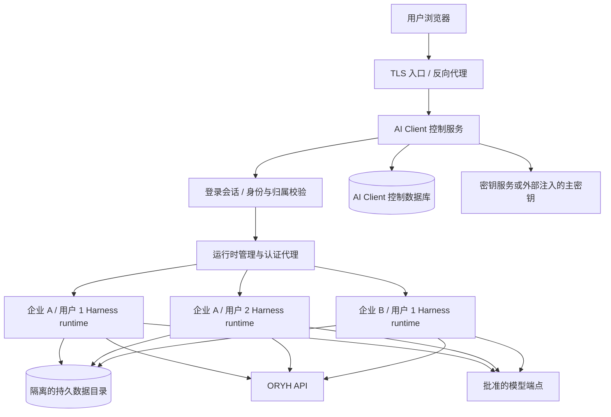

# ORYH AI Client 多租户服务器版实施方案

日期：2026-09-12。规划参考基线：`plugin-split` / `224be8f`。

状态：规划建议，尚未实施。本文是后续设计与实施的依据，不代表服务器版已经具备多用户能力，也不构成部署或业务数据迁移的执行授权。

关联文档：[技术架构](04-technical-architecture.md)、[认证与登录](09-authentication-and-login.md)、[插件迁移记录](14-dsh-plugin-migration.md)、[重构评审](18-plugin-split-review-2026-09-12.md)。评审后的修复已有后续提交；实施前按届时分支重新确认，不能把旧评审条目一律当成未解决问题。

## 1. 目标、决策与非目标

目标：ORYH AI Client 与 ORYH 一起部署在服务器上，作为独立应用容器对外提供浏览器入口。一个实例同时服务多个 tenant、多个用户；用户登录后自动获得自己的工作空间，能够使用传统业务页面和原生 Harness Chat。

建议采用“共享入口、隔离运行时”架构：

- 一个对外站点和应用容器；数据库及持久卷作为配套基础设施，不要求塞进该容器。
- 每个 `(oryhDeploymentId, tenantId, userId)` 对应独立 Harness 运行时、运行时 HOME、凭据范围与数据根。
- 同一身份可以拥有多个逻辑 Workspace；每个 Workspace 可以拥有多个 Session。
- 运行时按需启动、空闲回收，不能等同于“每个注册用户永久常驻一个进程”。
- 首版只开放受控业务能力，不提供任意 Shell、代码执行、服务器目录浏览或用户安装插件。
- 复用 Harness 的 Profile、Session、Agent、模型、Composer、Connection、Gateway、Remote、Slot 及生命周期。不重写聊天前端、模型循环或第二套业务页面框架。

明确区分：服务实例是对外产品；容器是部署单元；Harness runtime 是执行与状态单元；Workspace 是归属和组织单元。一个容器可托管多个 runtime。仅建立多个 Workspace 目录不能代替授权隔离。

首版非目标：跨用户共享会话、团队共享文件夹、任意插件市场、后台自主审批、多节点高可用、无损接续被杀死的模型推理，以及让 AI Client 直接读写 ORYH 业务数据库。

## 2. 当前基础与必须验证的假设

| 已有基础 | 服务器版缺口 |
| --- | --- |
| 领域服务通过结构接口接收 HTTP、连接与存储 | 需接入请求身份及服务器存储适配器 |
| `createLocalOryhRuntime` 创建本地组合 | 缺少按身份创建、定位、启动、回收运行时的管理器 |
| 系统 Keychain、加密文件、连接元数据 | 需服务器密钥管理、数据库归属、刷新令牌并发控制 |
| Host 明确限制 `developmentOnly: true` | 不能只移除限制，必须增加独立服务器组合及验证 |
| 浏览器原生 Workspace/Session | 需自动分配目录并限制全部原生管理接口 |
| 浏览器本地显示偏好 | 需服务端持久化以跨浏览器、跨设备恢复 |
| ORYH 存在授权码加 PKCE 实现 | 需验证客户端身份、回调域名、部署版支持与 tenant 授权语义 |

本机源码说明：

- [本地 runtime](../packages/core/src/local-runtime.ts)使用单个数据根与系统 Keychain。
- [Host 插件](../packages/dsh-host/src/index.ts)目前明确拒绝生产多用户组合。
- Harness Workspace 是目录及 Session 归属管理，不能据此宣称它已实施多租户授权。
- ORYH 的 `app/api/oauth.py` 描述授权码加 PKCE，使用不透明访问令牌和轮转刷新令牌；不能假设它是 OIDC，不能尝试从 JWT claims 推断身份。

以下均为 P0 验证项，而不是已确认的框架能力：原生前端能否通过受保护的路径或子域代理运行；HTTP、WebSocket 和流式 Remote 能否一致路由；原生接口如何限制；Profile 与 HOME 的完全隔离；运行时进程启动和终止是否可稳定管理。

## 3. 总体结构

控制服务负责身份、归属、代理、配额和运行时管理；业务工作区继续显示现有 Harness 前端与 ORYH Client 插件。可有少量登录、企业选择、运行时启动状态页面，它们不扩展为第二套业务应用。

## 4. 身份、登录与请求路由

### 4.1 登录流程

1. 浏览器访问 AI Client，控制服务创建一次性登录事务，记录 state、PKCE verifier、过期时间及经过校验的返回位置。
2. 重定向到批准的 ORYH 部署完成登录授权。服务端保存登录事务，不在日志里记录授权码、verifier 或令牌。
3. 回调验证 state、有效期和一次性消费，服务端换取令牌，再调用 ORYH 身份接口取得稳定身份。
4. 使用权威 tenant 归属验证创建内部 Principal。不得用浏览器传来的 tenantId 自行组合用户身份。
5. 浏览器只取得 AI Client 的不透明登录会话 Cookie，使用 HttpOnly、Secure、合适的 SameSite；状态改变请求做 CSRF/Origin 校验。
6. 自动查找或创建当前身份的默认 Workspace，启动对应 runtime，再进入 Harness 工作台。

ORYH 如已登录，是否免再次输入密码由其授权流程决定；不能直接读取或复制 ORYH 的登录 Cookie。OAuth 客户端注册方式、允许回调、CIMD 要求、注销与撤销能力均在 P0 核实。

### 4.2 Tenant 切换

Principal 至少包含：`principalId`、`oryhDeploymentId`、`tenantId`、`userId`、`employeeId`（可空）、授权版本/最近验证时间。

同一自然人可能属于多个 tenant，但是否存在全局 userId、如何列出 tenant 必须服从 ORYH 实际接口。若不能权威查询 membership，就对每个 tenant 分别授权，不能自行生成授权关系。

每个标签页绑定明确的 runtime 路由句柄。不能使用一个全局“当前 tenant” Cookie 来决定所有标签页的目标，否则用户在第二个标签页切换企业会改变第一个标签页的请求归属。既有 Session 不随企业选择迁移；跨企业复制聊天首版禁用。

### 4.3 Harness 认证代理

- 只向外暴露控制服务，runtime 监听私有 Unix socket 或受控本机端口。
- runtime 的启动令牌、内部 Cookie 由控制服务持有，绝不把 `dsh web` 启动 URL 作为用户登录凭据分享。
- 每次 HTTP 请求、WebSocket 握手、事件订阅、下载和取消操作，都从已认证主体验证归属后路由。
- 外部传入的身份头先剥离；可信身份不能来自用户可设置的请求头。
- 代理只转发登记的 runtime 目标，不能让用户指定端口、目标 URL 或任意文件路径。
- Cookie、Location、绝对资源路径、WebSocket URL、原生前端路由需一并验证；不能只让首页能够打开。
- 优先验证路径前缀方案；若 Harness 对根路径存在不可配置假设，评估受控 runtime 子域及短期一次性引导票据。子域须有独立、host-only Cookie 和严格路由归属，不能使用覆盖全部租户的宽域 Cookie。
- 若两种方式都需要持续修改 Harness 私有实现，暂停该组合，先确定公开扩展点或提交上游支持，不能靠零散代理补丁进入生产。

## 5. Workspace 与运行时隔离

### 5.1 归属模型

逻辑层级：`ORYH deployment → tenant → user → workspace → session`。

默认采用每个身份一个 runtime，其中拥有多个 Workspace。Workspace 是服务端分配的逻辑 ID；磁盘路径用不透明 ID 构造，不使用邮箱、用户输入路径或直接拼接业务标识。

Workspace 创建通过管理服务校验归属、分配目录，再调用可用的 Harness 公共接口注册。隐藏“Choose workspace”按钮不够，原生目录选择、注册任意路径等接口也必须禁用或受服务端约束。

不同 Workspace 共享同一身份 runtime，因此首版不宣称它们之间具有与不同用户相同的安全隔离等级。若用户需要项目间的严格执行隔离，应采用每 Workspace 独立 runtime/沙箱，并另行设计。

### 5.2 运行时生命周期

状态：`stopped → starting → ready → draining → stopped`；失败进入 `failed`，可重试但有退避和次数限制。

RuntimeManager 需提供：

- `ensureRuntime(owner)`：按身份幂等启动，多个标签页同时打开只创建一个有效 runtime。
- `resolveRoute(subject, handle)`：校验拥有者和运行时代次，返回内部目标，不向浏览器暴露内部认证秘密。
- `drainRuntime(owner)`：停止接收新任务，等待活动任务或到达截止时间，保存状态后关闭。
- `reconcileRuntime()`：识别崩溃、孤儿进程、过期锁，按持久状态恢复。

运行时记录包含 owner、状态、generation、租约期限、最近活动及内部启动信息。多 worker 阶段需要分布式租约与 fencing；在证明存储支持多写者前，同一身份数据目录必须只有一个 runtime 写入。

空闲不能仅按浏览器连接数判断：模型推理、上传、业务确认和核对写入结果期间均不能回收。租约/代次与业务操作 ID 的处理必须防止旧进程恢复后继续写入。

### 5.3 安全能力边界

第一版采用受限业务 Profile：不开放任意 Shell、代码执行、自由文件路径、用户安装/修改插件、任意 Hook、任意 MCP 服务连接或恢复管理员工具集。审核全部原生 Remote 命名空间，包括 Session、Workspace、模型设置、文件、插件管理和导出接口；不能仅限制模型工具白名单。

独立进程不是强沙箱。若多个进程使用同一 OS 用户并可读共享目录，不能声称已实现文件隔离。服务器组合应使用可落实的独立 OS 身份及目录权限，或其他等效隔离；不得给子进程数据库管理员凭据、全局主密钥或全局 runtime 控制权。

若单容器无法满足目标威胁模型，或需要运行不受信任代码，采用独立 worker/执行容器。保留一个对外产品实例不要求所有执行都位于同一容器。禁止为坚持“单容器”而降低数据隔离要求。

## 6. 存储、凭据和恢复

### 6.1 数据分工

| 数据 | 建议存储 | 规则 |
| --- | --- | --- |
| Principal、登录会话、membership 绑定 | AI Client PostgreSQL 数据库/独立 schema | ORYH 仍是身份与权限事实源 |
| Runtime、Workspace 归属及状态 | 控制数据库 | 复合归属约束，服务端校验 |
| Harness Session、原生日志与设置 | 首版保留 Harness 支持的持久化后端及隔离持久目录 | 不擅自复制或重写 Session 事件格式 |
| 业务草稿、意图、确认及核对状态 | 服务器事务存储适配器 | 保留版本、一次性确认和结果不明状态 |
| 上传文件与生成附件 | 首版隔离持久卷；后续可对象存储 | 下载始终校验归属，不作为公共静态资源 |
| 显示偏好、固定查询 | 服务端按 owner/workspace/view 保存 | 浏览器仅做缓存 |
| 正式工时、项目、库存等 | ORYH | 只调用 ORYH API，不直写其数据库 |

建议逻辑表：`principals`、`login_sessions`、`workspaces`、`runtime_leases`、`credential_refs`、`model_profiles`、`view_preferences`、`operation_intents`、`audit_events`。物理表与是否新增 Session 归属索引在 P0 之后确定，不能制造第二个 Session 内容事实源。

所有用户资源的关系约束带 owner；只凭随机 ID 不算授权。若采用数据库 RLS，要处理连接池复用下的事务级身份设置，防止连接上的 tenant 上下文泄漏；应用层仍校验归属。

### 6.2 凭据与模型配置

提供服务器 CredentialVault 适配器，替换桌面 Keychain。访问令牌、刷新令牌、模型 Key 采用经过维护的加密方案，使用 KMS/Secrets 服务或外部挂载的主密钥；主密钥不写镜像、业务数据库或源码。记录 key version，定义轮换和备份恢复路径。

浏览器、Session、模型输入和普通日志不包含真实凭据。runtime 如需凭据，只能得到本身份授权的最小范围；可通过私有凭据代理按 owner 注入。运行参数、进程环境及诊断转储也要避免泄漏。

刷新令牌轮转按凭据记录串行化并使用版本比较。多个标签页或请求同时到期，只执行一次刷新；撤销与刷新竞态不能重新激活已撤销凭据。

模型配置支持企业管理员默认值及可选个人配置。优先级和费用归属明确展示；API Key 只可替换/删除，不提供明文读回。基础 URL 由部署策略约束，允许显式配置的内网模型服务；不能开放任意 URL 访问云元数据、管理网络或其他 runtime。

显示偏好从 localStorage 导入时只接受字段白名单和显示值，不导入任何权限或凭据；采用服务端版本号处理并发更新。

### 6.3 崩溃与持久化语义

原生 Session、草稿与正式操作分别定义恢复语义。不能承诺容器重启后继续同一次模型推理；可恢复历史、标记中断并由用户重新发起。

确认绑定 owner、Session/Workspace、意图版本和有效期，正式执行前再次校验权限及业务状态。写入发出后断线或进程崩溃，保留“结果待核对”，调用已有 reconcile 路径；不可盲目重发创建、提交或审批。

数据库与文件备份需要一致的恢复方案、密钥恢复及定期演练。首版不自动迁移所有桌面凭据和聊天；需要迁移时采用显式导入及重新授权，另行限定数据范围。

## 7. 权限、会话与命令联动

授权关系：登录身份 → tenant membership → Workspace/Session 归属 → ORYH 功能权限 → 业务记录/单据状态 → 操作确认。

- 用户只能列举、读取、删除、导出、订阅和取消自己的 Session。
- 模型请求使用当前用户的 ORYH 委托身份，不统一改用企业管理员账户。
- 权限变化从 ORYH 获取；菜单更新属于表现层，Remote 和正式执行仍必须检查。
- 注销/撤权应拒绝新请求，关闭相关长连接，取消尚未发送的建议与操作。已发出的写入仍须核对结果，不能宣称注销可以回滚它。
- 同一 Session 多标签页使用明确的绑定代次、表单 revision 和命令 ID；首版建议每个 Session 同时只有一个主动表单编辑者，其他标签页提示占用或只读。
- 同步帧不能因重连重复执行；终态清除旧命令。网络断线与权限拒绝分开处理。
- 审计至少记录 actor、tenant、workspace、session、operationId、状态和关联请求 ID；敏感内容与令牌不进入通用审计。

现有后端部分读取接口只有企业隔离，不具备独立查看权限。服务器化不会自动修复该权限模型，需向用户明确功能入口限制与 ORYH 数据读取权限的差别。

## 8. 对当前仓库的改造分工

下列名称是建议职责，不要求每一项立即成为独立包。

| 位置/职责 | 计划变化 |
| --- | --- |
| 新增 server/control 组合 | 登录会话、归属校验、认证代理、RuntimeManager、健康检查 |
| `packages/core` | 保留本地组合，增加可注入的服务器组合；剥离默认路径与 Keychain 假设 |
| `packages/store` 及领域存储接口 | 实现服务器适配器与并发版本语义，保留现有领域操作行为 |
| `packages/dsh-host` | 明确 local/server 模式及可信 runtime owner；由已验证服务器组合启用，不能简单删 developmentOnly 检查 |
| `packages/web` | 自动 Workspace、企业选择、连接状态、服务端偏好；保留原生 Chat 和现有业务视图 |
| `packages/dsh-bundle` | 新增受限服务器 Profile，管理可用原生能力与用户设置权限 |
| 领域包 | 原则上不改业务规则，只接受可信身份和存储适配器 |
| 部署脚本/镜像 | 固定 Harness 版本及补丁、构建生成 Remote、准备持久目录和进程权限 |

控制服务可新增身份和资源管理 API，但不另写一套业务 HTTP API 替代已有 typed Remote。任何调用者身份上下文都必须由服务端建立，不能依赖模型参数注入。

## 9. 分阶段实施步骤

阶段顺序：`P0 → P1 → P2 → P3 → P4 → P5 → P6`。阶段之间以验证结果推进，不以包创建完成或首页打开作为完成标准。每阶段保留本地版回归。

### P0：框架适配与隔离原型

目的：验证方案能否在当前 Harness 公共能力上成立，避免先建设大规模控制层。

步骤：

1. 固定目标 Harness commit、现有补丁和生成器产物契约，建立干净环境构建说明。
2. 列出服务器 Profile 全部原生 Remote、WebSocket、文件和设置入口，分类为允许、受控代理、禁用。
3. 在隔离的试验环境启动四个身份的 runtime：企业 A 用户 1/2、企业 B 用户 1/3；其中用户 1 在两企业分别授权。
4. 用同一入口验证原生页面、静态资源、Remote、流和下载的代理，不依赖公开 runtime 端口。
5. 验证不同 HOME、目录、运行身份、模型设置、Session registry 与认证状态没有共享。
6. 验证 ORYH 授权码+PKCE 回调、身份确认与租户切换的实际契约。
7. 比较路径前缀与子域方案；测量四个 runtime 的空闲/活动资源开销。

交付：接口暴露清单、运行时隔离验证报告、认证与代理选型 ADR、容量测量基线、修订后的实施估算。

退出条件：四身份同时使用，跨身份的 Session 列表、读取、订阅、下载和管理接口均被拒绝；不暴露内部启动凭据；不依赖未记录的 Harness 私有修改。

停止条件：只能靠浏览器隐藏按钮隔离、不能阻止共享目录读取、代理导致原生接口绕过身份校验、或需要大范围修改 Harness 内核。此时评估每身份独立执行容器或公开接口支持，不进入 P1 大规模实现。

### P1：服务器登录与可信身份

步骤：

1. 实现部署级 ORYH origin allowlist 与授权客户端配置。
2. 建立 OAuth 事务、AI Client 登录会话、Principal、过期与注销流程。
3. 接入 membership 验证；若后端不支持枚举租户，采用分别授权方案。
4. 建立 owner 解析中间层，对外请求不接受可信身份字段。
5. 引入服务器 CredentialVault、刷新锁、凭据版本和撤销状态。
6. 实现企业选择与权限核验失败页面，不增加业务功能。

交付：登录 API 与最小入口 UI、数据库迁移、凭据接口、威胁边界说明。

退出条件：重复/过期回调、伪造 tenant、注销后请求和并发刷新均有自动测试；刷新与撤销竞态不能恢复已撤销令牌；浏览器和日志中无服务端凭据。

### P2：RuntimeManager 与认证代理

步骤：

1. 实现按 owner 幂等创建、查找、启动和回收 runtime。
2. 管理专用 HOME、Profile、持久目录及 OS 权限，runtime 不继承控制服务全部秘密。
3. 接入 P0 确定的代理方式，统一处理 HTTP、WebSocket、流式响应、下载与退出。
4. 实现 generation、单写者锁、异常进程清理、超时启动及空闲回收。
5. 加入运行时数量、单用户活动任务和总并发上限；超限明确排队或拒绝。
6. 封闭原生插件安装、任意路径注册等不允许入口，直接调用也必须拒绝。

交付：运行时管理服务、服务器 Profile、代理契约测试与进程管理测试。

退出条件：同一用户多个标签页只启动一个 runtime；不同身份不可切换路由句柄访问彼此；进程崩溃可恢复；旧进程不能与新进程同时写同一数据根。

### P3：Workspace 与服务器持久化

步骤：

1. 实现默认 Workspace 自动创建、命名、列表及归属验证，通过公开接口关联 Harness Workspace。
2. 接入 Session 持久目录与备份；验证 Session 列表、导出、引用等原生接口的归属。
3. 实现业务意图/草稿的服务器存储适配器，保留 prepare/confirm/reconcile 状态机。
4. 接入上传附件、下载鉴权、文件大小与配额限制。
5. 将显示偏好和固定查询迁到服务器；实现版本冲突策略与可选本地偏好导入。
6. 建立删除/停用流程，分开“撤销访问”和“按保留策略清理数据”。

交付：数据模型与迁移、持久卷约定、存储适配器、恢复手册。

退出条件：换浏览器可恢复工作区与偏好；容器重建后历史与草稿可恢复；确认后断线不重复写入；跨用户猜测 Workspace/Session/附件 ID 无法读写。

### P4：业务、模型与多标签页联动

步骤：

1. 将领域服务注入可信 owner、用户 ORYH 连接和服务器存储；继续使用现有 typed Remote。
2. 验证权限变化在菜单、页面、工具和正式确认各层生效。
3. 完善命令流绑定代次、重连和单 Session 编辑者策略，覆盖多标签页。
4. 实现企业默认模型、个人覆盖规则、Key 隔离、端点策略及费用归属。
5. 加入用户/tenant 请求并发与模型额度限制；断线重试不能创建第二个同一任务。
6. 在服务器版回放工时填写、项目选择、审批核对、列表列配置及产品查询，不仅检查工具调用成功，还比较实际页面值。

交付：完整可用的服务器版业务工作台及自动化回归。

退出条件：模型不可用时传统页面仍可用；A 的模型 Key 不用于 B 的任务；切换企业不改变另一标签页的请求身份；审批仍需用户确认、分配与状态校验。

### P5：容器化、并发与恢复验收

步骤：

1. 构建固定版本镜像，构建期生成插件及 Remote，启动期不安装 npm 包或应用临时源码补丁。
2. 部署入口服务、数据库、持久卷和外部密钥；runtime 端口不发布到宿主公网。
3. 加入存活、就绪、运行时状态、请求指标和受控诊断日志。
4. 实现 SIGTERM 停止接单、任务排空、超时终止及启动后的结果核对。
5. 测试反向代理长连接超时、重连、数据库短暂不可用、磁盘满和内存压力。
6. 完成备份恢复、密钥轮换与版本回滚演练。

交付：镜像/Compose 示例、部署配置说明、监控指标、容量报告及运维手册。

退出条件：满足第 10 节的隔离与恢复测试；给出实测容量及限制，不把“一个容器”解释为无上限并发。

### P6：试点、灰度与上线

步骤：

1. 使用独立测试 tenant 验收，通过后选择少量企业与用户试点；保留本地版入口。
2. 首先开放查询与未保存表单填写；完成验收后再按业务风险开放正式提交与审批。
3. 对比用户请求、页面生效值、操作意图及 ORYH 最终结果，记录失败原因。
4. 审查资源、重连和权限事件；达到试点门槛后逐步放大用户范围。
5. 记录版本、迁移和回滚点，发布支持范围与当前限制。

退出条件：隔离测试零跨身份泄漏；业务数据未发生重复创建/审批；试点问题已归因并关闭阻断项；备份与回滚可执行。

## 10. 验收矩阵与容量计划

### 10.1 隔离与正确性矩阵

测试身份至少为：A1、A2（同 tenant 不同用户）、B1（与 A1 同自然人但不同 tenant）、B3（不同 tenant 不同用户）。再加入一个已撤权用户和一个未绑定员工的用户。

| 场景 | 预期结果 |
| --- | --- |
| A1 使用 A2/B1 的 Workspace、Session、附件 ID | 拒绝读写、列举、订阅、导出、取消；返回不泄漏内容 |
| 两 tenant 恰好使用相同业务记录 ID | 按部署与 tenant 范围定位，不串数据 |
| 伪造身份头、runtime 句柄或内部地址 | 不能改变服务端派生身份和目标 |
| 首帧前/流中断网、runtime 重启 | 可恢复同步或明确提示；不重放已执行业务写入 |
| 两标签页同时编辑/提交同一 Session 表单 | 明确编辑者或版本冲突，无静默覆盖与双重执行 |
| 两请求同时触发令牌刷新 | 只产生一个有效轮转结果，失败不会丢掉有效凭据 |
| 权限撤销后使用旧页面/旧确认 | 不执行新的正式操作，长连接及入口按策略失效 |
| 文件路径穿越、符号链接及下载 URL 复用 | 不能跨 owner 目录或绕过下载授权 |
| 直接调用原生插件/设置/Workspace 管理接口 | 不可恢复被禁用的能力或注册任意路径 |
| 服务中断发生在 ORYH 写入之后 | 标记待核对，恢复后 reconcile，不盲目重试 |
| 删除 Workspace 后重用旧链接 | 不可继续访问已撤销资源；保留数据遵循既定策略 |
| 模型填入存在但不符合用户要求的项目 | 被正确性校验或明确核对发现，不以传输成功作为验收通过 |
| A 模型调用占满额度或失控重试 | B 有独立配额和可预测服务；A 被限流或排队 |
| 用户修改 UI 或浏览器缓存权限 | 不改变服务端授权结果 |

数据库/RLS、应用鉴权、runtime 路由、文件访问和原生接口应分别测试；一条业务 API 返回 403 不代表其余层都已隔离。

### 10.2 容量试验

首轮建议在固定规格测试机上测量 4、10、20 个同时活跃身份，分别运行纯页面查询、流式 Chat、混合查询与填写。数字是试验梯度，不是已承诺支持人数；超过资源预算时停止增加并发。

测量：空闲与活跃 runtime 的 RSS、启动时间、事件循环延迟、CPU、文件描述符、流连接数、数据库连接、模型排队时间、代理开销、P95 页面查询时间与故障恢复时间。

容量估算分开控制进程、每个空闲 runtime、每个活动任务及模型服务额度，并保留余量。P0 输出初测，P5 才确定上线并发上限、空闲回收阈值和目标恢复时间。记录浏览器在线数、活跃身份数及正在推理任务数，不能把三者混为并发人数。

## 11. 部署、升级与回滚

建议部署单元：AI Client 应用容器（控制服务与受限 runtime）、独立 PostgreSQL 数据库或逻辑隔离 schema、持久卷、外部密钥，以及现有 ORYH 服务。首版可复用数据库服务器，但不共享 ORYH 业务表的写权限。

配置至少包括：公开访问地址、允许的 ORYH 部署、OAuth 客户端/回调、数据库连接、密钥引用、数据根、服务器 Profile、运行时上限、任务并发、空闲超时、附件限额、批准的模型端点、日志与保留策略。敏感配置通过 Secrets 提供，不能放进前端构建变量。

升级步骤：

1. 固定镜像、Harness 与 Profile 版本，验证补丁和生成契约。
2. 备份控制数据、持久目录和密钥恢复所需元数据。
3. 停止接收新任务，排空或明确中断现有任务；把未确认写入保留为待核对。
4. 执行可审查的数据迁移，启动新版本，验证登录、Session 恢复、命令流及查询。
5. 按试点范围逐步恢复流量。

回滚必须同时考虑数据库 schema、领域意图格式、Harness Session/配置格式和密钥版本。若旧镜像不能读取新数据，不能只切回镜像；应使用预先验证的恢复点或向前修复。回滚本身不回滚 ORYH 已发生的业务事实，恢复后仍要核对这些操作。

首版单容器存在进程组、宿主和应用实例的单点，不宣称高可用。后续横向扩展时，将 RuntimeManager 的执行侧迁到 worker，保持相同 owner/generation 路由；同一 runtime 的长连接稳定路由，同一数据根单写，不采用随机负载均衡直接分发 Harness 请求。

## 12. 工作包、估算方式与决策清单

建议按可审查的工作包提交，避免一个巨型改动混合登录、存储、业务规则与部署：

| 工作包 | 主要依赖 | 可审查成果 |
| --- | --- | --- |
| S0 框架适配验证 | 当前重构基线 | P0 报告、接口清单、认证代理 ADR |
| S1 身份与凭据 | S0 | 登录、归属、刷新/撤销测试 |
| S2 运行时与代理 | S0/S1 | 生命周期、路由、禁用接口测试 |
| S3 Workspace 与存储 | S1/S2 | 数据迁移、持久化、恢复测试 |
| S4 业务与模型接入 | S2/S3 | 服务器组合、页面/工具联动回归 |
| S5 部署与运行保障 | S2/S3/S4 | 镜像、容量与故障演练 |
| S6 试点上线 | S5 | 试点记录、运维与回滚手册 |

时间估算在 P0 后按实际改造面更新。尤其不能预先把原生接口隔离、Profile 受限能力和服务器代理当作已解决问题。可并行准备存储设计、配置清单和测试矩阵，但认证/路由选型未验证前不批量实现依赖它们的功能。

实施前确认或在 P0 内解决：

| 决策 | 建议默认值 | 何时确定 |
| --- | --- | --- |
| ORYH 部署范围 | 配置允许的部署列表，禁止用户输入任意 origin | P0 |
| 单用户多企业身份 | 权威 membership 或分别授权，禁止推测 | P0 |
| 路径代理或子域 | 以 Harness 原生功能完整通过为依据 | P0 |
| 运行时隔离粒度 | 每 deployment/tenant/user 一个 | P0 |
| Shell、代码与插件安装 | 首版全部关闭 | P0 |
| Workspace 数量 | 自动创建一个，数据模型支持多个 | P3 前 |
| 用户自带模型 Key | 默认企业配置；是否允许个人覆盖由 tenant 策略决定 | P4 前 |
| 登录/权限失效时限 | 依据 ORYH 撤销机制与业务要求设定，并测试长连接 | P1/P4 |
| 数据保留、删除与备份目标 | 由部署方明确，禁止默认为永久保存 | P3/P5 |
| 上线并发与恢复目标 | 依据固定规格压测报告 | P5 |
| 桌面数据迁移 | 首版不自动迁移；如需要另列工作包 | 试点前 |

## 13. 完成定义

服务器版完成的依据是：真实多 tenant、多用户在同一入口同时使用，浏览器自动进入自己工作空间；原生 Harness 和 ORYH 业务能力均落实归属校验；Chat 与传统页面一致；正式写入保留用户确认；重启、断网、撤权、并发编辑可预测；数据及密钥可恢复；部署和回滚有经过验证的路径。

“容器启动成功”“多用户能登录”“建立了不同目录”均不是单独的完成标准。
